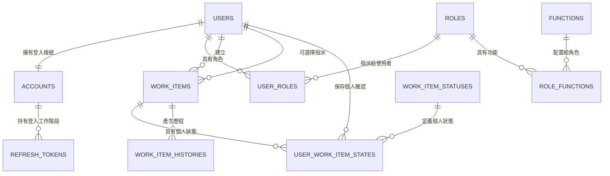
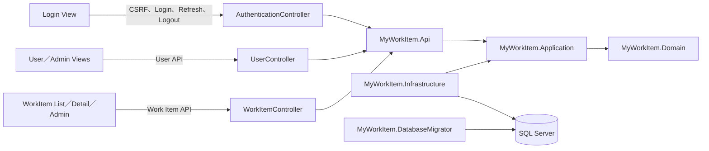

# MyWorkItem Backend 實作計劃（Draft）

## 文件狀態

- 狀態：**待需求與 Schema 決策確認，尚未進入實作**
- 適用分支：`dev2`
- 規劃範圍：`MyWorkItem_Backend`
- 需求來源：`Draft/MyWorkItem.md`
- 資料模型來源：`Draft/Schema.md`
- 靜態資料來源：`Draft/StaticData.md`
- 架構草圖來源：`Draft/MyWorkItem_C3.drawio`
- 開發規範來源：`Agent.md`

目前 Repository 沒有 `.specify/`、`specs/<feature>/spec.md` 或 Spec Kit Plan Template，
因此本文件是依現有 Draft 人工整理的實作計劃，尚未經過 Spec Kit Specify／Clarify 流程。
本文件不代表資料模型已核准，也不授權建立正式 Migration。

## 1. 需求理解與範圍

### 1.1 核心流程

1. 使用者登入後查看 Work Item 列表與詳情。
2. 使用者可暫時勾選一或多筆 Work Item，再批次確認。
3. Checkbox 是前端暫存 UI 狀態；後端只保存每位使用者的確認結果。
4. 使用者可撤銷自己的確認，重新整理或重新登入後仍保留先前結果。
5. 不同使用者操作同一筆 Work Item 時，確認狀態彼此隔離。
6. 管理員可新增、修改及刪除 Work Item。
7. 一般使用者與後台使用者先進入 Login View，再由獨立的 `AuthenticationController`
   處理登入、Refresh Token 與登出。
8. 系統需提供可操作 UI；本 Repository 規劃提供後端 API，UI 應由獨立前端專案整合。

### 1.2 本 Repository 預定負責

- ASP.NET Core Web API；Authentication 使用獨立 `AuthenticationController`，不混入
  `UserController`。
- JWT Cookie、Refresh Token、Authorization、CSRF、Swagger／OpenAPI。
- Work Item 查詢、CRUD、個人確認及批次確認 Use Case。
- Account、User、Role、Function 與權限資料存取。
- SQL Server Schema、DbUp Migration、開發／測試種子資料。
- Dockerfile、Docker Compose、Health Check 與開發環境文件。
- 單元測試、整合測試及 API 契約。

### 1.3 不在本 Repository 直接實作

- Vue 頁面、Router、Pinia、表單與 Checkbox UI。
- Login View 與登入後導頁的前端實作。
- 前端排序／分頁狀態保存與確認對話框呈現。

上述功能仍屬整體驗收範圍，後端需提供足以支援它們的 API 契約。若使用者要求改採
MVC／Razor 單體架構，需先調整架構決策，不能同時沿用「前端獨立專案」假設。

## 2. Draft 交叉審查結果

### 2.1 必須在實作前確認的議題

| 編號 | 議題 | 現況與風險 | 建議預設方案 |
| --- | --- | --- | --- |
| D-01 | Account 與 User 關係 | Mermaid 使用 `Account ||--o{ User`，欄位又以 `Account.UserID` 指向 User，無法判斷是一對一或一對多 | 一個 User 對應一個 Account；`Accounts.UserId` 設 FK 與 UNIQUE |
| D-02 | 角色歸屬 | Schema 使用 `UserRole.UserID`，但登入身分由 Account 產生 | 角色屬於 User；JWT 由 Account 找到 User，再計算角色與 Function 聯集 |
| D-03 | WorkItem 主鍵 | `WorkItemID`、`CreateUserID`、`AsignUserID` 同時標為 PK，會讓同一 Work Item 的識別與非鍵欄位相依變得不清楚，並產生 2NF 風險 | 僅 `WorkItemId` 為 PK；建立者與指派者改為 FK |
| D-04 | 指派與可見性 | Schema 有 `AsignUserID`，C3 寫「瀏覽自己的 WorkItem」，需求卻寫每位登入使用者都能看到管理者新增的列表 | 依較明確的需求文件：所有登入使用者看到全部有效 Work Item；指派者只作管理資訊，或確認不需要後移除 |
| D-05 | 狀態語意 | `WorkItem.Status` 是全域欄位，但 `StaticData.md` 的 `Pending／Confirm` 依需求其實是每位使用者的個人狀態 | `Pending／Confirm` 不存入 WorkItems；由 `UserWorkItemStates` 保存每位使用者的狀態 |
| D-06 | WorkItemStatus 約束 | `WorkItemStatusID` 未標 PK，且目前沒有任何 FK；`Confirm` 的命名也需確認是否改為 `Confirmed` | `WorkItemStatuses` 使用穩定代碼 PK，作為 `UserWorkItemStates.WorkItemStatusId` 的 FK；不把它當成 Work Item 全域生命週期 |
| D-07 | 個人確認資料 | Draft 沒有可保存 `(UserId, WorkItemId)` 的表 | 新增 `UserWorkItemStates`，以 `(UserId, WorkItemId)` 為複合 PK；沒有資料列時視為 `Pending`，確認時 Upsert 為 `Confirm` |
| D-08 | 歷程表鍵值 | `WorkItem_History` 多欄標為 PK，且 `Action` 是字串，但另有 Action 表未建立關係 | `HistoryId` 單一 PK；保留 WorkItemId 與快照，Action 使用受約束代碼或 FK |
| D-09 | 刪除策略 | WorkItem 有 `IsDeleted`，需求只稱「刪除」，歷程又要求保留 | 採軟刪除；一般查詢排除，確認與歷程資料保留，不使用 Cascade Delete |
| D-10 | 密碼欄位 | `Account.Password` 暗示保存明碼 | 欄位改為 `PasswordHash`，禁止保存或記錄明碼 |
| D-11 | ID 與型別 | 所有 ID 使用 `nvarchar(200)`、時間使用未定義時區的 `DateTime`；Description 也只有 200 字元 | 技術主鍵優先 `uniqueidentifier`；代碼使用有界限 `nvarchar`；時間使用 UTC `datetimeoffset`；Description 依需求放寬並明確限制 |
| D-12 | 文件位置 | `Agent.md` 稱原稿位於根目錄 `Schema.md`，實際檔案在 `Draft/Schema.md` | Schema 核准時一併修正規範中的來源路徑，但保留 Draft 原稿不覆寫 |
| D-13 | 角色靜態資料 | `RoleID` 欄位是 `nvarchar(200)`，靜態資料卻使用 `0／1／2`；數字外觀容易被誤認為排序或 Identity | 決定 RoleID 是技術主鍵或業務代碼；建議另設唯一 `Code` 為 `Admin／Worker／Manager`，不要依賴 0、1、2 的順序判斷權限 |
| D-14 | Function 靜態資料 | 需求要求角色對應多個 Function，但 `StaticData.md` 沒有 Function 與 RoleFunction 種子資料 | 在 Migration 前核准 Function Code 與角色對應矩陣，否則無法完成 Function-based Authorization |
| D-15 | Action 關係 | Static Data 定義 `INSERT／UPDATE／DELETE`，但 `WorkItem_History.Action` 是自由字串，Action 表也未標 PK | `Action.ActionId` 設 PK，History 使用 `ActionId` FK 或 CHECK；Migration 與程式共用相同穩定代碼 |
| D-16 | 權限管理範圍 | C3 有 User、Role、Function Service，但核心使用情境只明確要求 Work Item 管理；若直接完成全部 CRUD，會擴大 MVP | Phase 0 確認本次是「完整管理 API」或「種子角色＋角色指派」；未確認前不自行擴張 |

在 D-01 至 D-16 未取得確認前，只能建立 Schema Review、Static Data Review、API 草案與測試案例清單，
不得建立正式 Migration 或把以下建議模型視為定案。

### 2.2 建議資料模型（待核准）



預定資料表責任：

- `Users`：人員基本資料。
- `Accounts`：登入名稱、PasswordHash、啟用狀態，與 User 一對一。
- `Roles`、`Functions`、`UserRoles`、`RoleFunctions`：角色與 Function-based Authorization。
- `RefreshTokens`：只保存 Token Hash、有效期限、撤銷與 Token Family。
- `WorkItemStatuses`：個人確認狀態代碼，初稿為 `Pending／Confirm`；命名需核准。
- `WorkItems`：標題、描述、建立者、選擇性指派者、軟刪除與並行版本；不保存個人確認狀態。
- `UserWorkItemStates`：以 `(UserId, WorkItemId)` 唯一保存 `WorkItemStatusId`、
  `ConfirmedAt`、`UpdatedAt`；查無資料列時以 `Pending` 回傳。
- `WorkItemHistories`：保存管理端新增、修改、刪除的稽核快照；不取代目前資料。

### 2.3 Static Data 基線（待核准）

目前 Draft 提供：

| 類別 | 原稿代碼 | 規劃用途 |
| --- | --- | --- |
| Role | `0/Admin`、`1/Worker`、`2/Manager` | 使用者角色；需先決定 ID 與 Code 是否分離 |
| WorkItemStatus | `Pending`、`Confirm` | 每位使用者的個人確認狀態，不得寫入 WorkItems 的全域欄位 |
| Action | `INSERT`、`UPDATE`、`DELETE` | Work Item History 的操作類型 |

尚缺少 Function 與 RoleFunction 對應。建議先以以下矩陣作為審查草案，未核准前不建立種子資料：

| Function Code | Admin | Worker | Manager |
| --- | --- | --- | --- |
| `WorkItems.Read` | ✓ | ✓ | ✓ |
| `WorkItems.Confirm` | ✓ | ✓ | ✓ |
| `WorkItems.Manage` | ✓ |  | ✓ |
| `Users.Manage` | ✓ |  | 待確認 |
| `Roles.Manage` | ✓ |  |  |
| `Functions.Manage` | ✓ |  |  |

## 3. 目標架構

```text
src/
├── MyWorkItem.Api/              # HTTP、JWT Cookie、CSRF、授權、Swagger、ProblemDetails
├── MyWorkItem.Application/      # Use Case、DTO、驗證、Port 與交易邊界
├── MyWorkItem.Domain/           # Entity、Value Object、核心規則
├── MyWorkItem.Infrastructure/   # Dapper、SqlKata、SQL Server、Token、Password
└── MyWorkItem.DatabaseMigrator/ # DbUp、Migration、環境種子資料
tests/
├── MyWorkItem.UnitTests/
└── MyWorkItem.IntegrationTests/
```

相依方向：



- API 不直接包含商業規則或 SQL。
- Application 定義 Repository、Token、Clock、Current User 與 Transaction 抽象。
- Infrastructure 實作抽象；SqlKata 組合參數化查詢，Dapper 執行與映射。
- 每次資料操作使用獨立 Connection；需要原子性的操作明確共用 Transaction。
- DTO 不直接重用資料庫 Record 或 Domain Entity。
- `AuthenticationController` 僅處理登入工作階段；帳號與個資管理留在 `UserController`，避免
  Authentication 與 User Management 的責任混合。
- C3 的 `AccountService`、`RoleService`、`FunctionService`、`WorkItemService` 是 Application
  Use Case 的邏輯邊界，不代表 Controller 可以直接操作 Repository。

## 4. 預定 API 契約

以下路由是設計基線，需在 Schema 與前端契約確認後定稿。

### 4.1 Authentication

所有下列路由由獨立 `AuthenticationController` 提供。Login View 啟動時先取得 CSRF Token，
再送出登入請求；登入成功後由 HttpOnly Cookie 保存 JWT，前端不得自行保存或解碼 Refresh Token。

| Method | Route | 用途 |
| --- | --- | --- |
| GET | `/api/v1/auth/csrf` | 取得 CSRF Token |
| POST | `/api/v1/auth/login` | 登入並設定 Access／Refresh Cookie |
| POST | `/api/v1/auth/refresh` | 輪替 Refresh Token |
| POST | `/api/v1/auth/logout` | 撤銷 Token Family 並清除 Cookie |
| GET | `/api/v1/auth/me` | 取得目前使用者、角色與 Functions |

Login View 串接順序：

1. `GET /api/v1/auth/csrf`，取得前端可讀的 CSRF Cookie／Token。
2. `POST /api/v1/auth/login`，於 Header 帶入 CSRF Token，Body 只包含登入識別與密碼。
3. 登入成功後呼叫 `GET /api/v1/auth/me`，再依角色／Function 導向對應頁面。
4. 收到 Access Token 逾期回應時，只允許一次受控 Refresh；Refresh 失敗則回 Login View。

### 4.2 Work Items

| Method | Route | 權限與行為 |
| --- | --- | --- |
| GET | `/api/v1/work-items` | 登入使用者；分頁、關鍵字、建立時間排序，回傳自己的確認狀態 |
| GET | `/api/v1/work-items/{workItemId}` | 登入使用者；詳情與自己的確認狀態 |
| POST | `/api/v1/work-items` | `WorkItems.Manage`；新增 |
| PUT | `/api/v1/work-items/{workItemId}` | `WorkItems.Manage`；以 RowVersion 防止覆寫 |
| DELETE | `/api/v1/work-items/{workItemId}` | `WorkItems.Manage`；軟刪除 |
| PUT | `/api/v1/work-items/{workItemId}/confirmation` | `WorkItems.Confirm`；冪等確認目前使用者 |
| DELETE | `/api/v1/work-items/{workItemId}/confirmation` | `WorkItems.Confirm`；冪等撤銷目前使用者 |
| POST | `/api/v1/work-items/confirmations/batch` | `WorkItems.Confirm`；單一交易批次確認 |

確認 API 不接受前端傳入 `UserId`；操作者只能來自已驗證 JWT。所有寫入請求需驗證
CSRF Header。錯誤統一使用 ProblemDetails，並區分 400、401、403、404、409。

### 4.3 管理 API

- Users：查詢、建立、修改、啟停、重設密碼與覆寫角色；不提供硬刪除。
- Roles：查詢、新增、修改、啟停與配置 Functions。
- Functions：查詢、新增、修改與啟停。
- 是否列入本次面試 MVP，需依可用時間確認；Authentication 與 Admin／User 最小角色仍是
  Work Item 權限驗收的必要基礎。

### 4.4 前端契約邊界

- 後端只回傳資料與授權結果，不回傳或渲染 Login／Work Item HTML。
- Checkbox 暫選集合留在前端；只有確認或撤銷操作會寫入後端。
- 前端不得傳入 `UserId`、角色或 Function Header 來決定操作者與權限。
- API 回傳的個人狀態至少包含 `statusCode`、`isConfirmed`、`confirmedAt`；其中
  `isConfirmed` 是由個人狀態映射的便利欄位，不是 `WorkItems` 的資料欄位。

## 5. 分階段實作計劃

### Phase 0：需求與 Schema 決策閘門

產出：

- `Draft/SchemaReview.md`：逐表列出原稿、問題、建議、替代方案與決策。
- `Draft/StaticDataReview.md`：確認 Role、Function、RoleFunction、WorkItemStatus 與 Action 代碼。
- 已核准的 ERD 與資料字典；原始 `Draft/Schema.md` 不覆寫。
- API 契約與前後端責任邊界。
- Architecture Decision Records：UI 分離方式、可見性、軟刪除、歷程策略。

完成條件：D-01 至 D-16 全部有明確決策，且使用者核准後才進 Phase 1。

### Phase 1：Solution 與共用基礎

產出：

- 建立 .NET 10 Solution、五個正式專案與兩個測試專案。
- 設定 Nullable、Implicit Usings、集中套件版本、Analyzer 與格式規則。
- 建立 DI Composition Root、Options 驗證、ProblemDetails、Health Check、OpenAPI。
- 建立 `.gitignore`、`.dockerignore`、`.env.example`，不提交 Secret。

驗證：`dotnet restore`、`dotnet build --no-restore`、`dotnet format --verify-no-changes`。

### Phase 2：Database Schema、Migration 與種子資料

產出：

- 依核准 ERD 建立依序編號且不可回改的 DbUp SQL Migration。
- 建立 PK、FK、UNIQUE、CHECK、Index、RowVersion 與軟刪除欄位。
- 依核准的 Static Data Review 建立可重跑的 Role、Function、RoleFunction、WorkItemStatus 與
  Action 種子資料；程式碼不得依賴種子資料的顯示順序。
- Development／Test 建立最小 Admin 與一般 User；Production 不建立固定弱密碼。
- Migrator 在資料庫未就緒時提供有界限的 retry、timeout 與安全日誌。

驗證：空資料庫建置成功、重跑不重複套用、Static Data 不重複，Schema 約束與 Index 符合
核准文件。

### Phase 3：登入、安全性與權限

產出：

- PasswordHasher、JWT Access Token、Refresh Token Hash、輪替與 Family 撤銷。
- Secure／HttpOnly Cookie、環境化 SameSite／HTTPS、CORS Allowlist。
- CSRF Token endpoint 與所有寫入端點的全域驗證策略。
- Function-based Authorization，角色 Functions 取聯集。
- 建立獨立 `AuthenticationController` 提供 CSRF、Login、Refresh、Logout、Me；
  `UserController` 不包含登入工作階段端點。

驗證：依 Login View 契約完成 CSRF → Login → Me、刷新、登出、舊 Token 重播、停用帳號、
缺少／錯誤 CSRF、401／403。

### Phase 4：Work Item 查詢與詳情

產出：

- 分頁、關鍵字、建立時間升降序與一致的分頁 Metadata。
- 使用目前 UserId 對 `UserWorkItemStates` Left Join；無資料列映射為 `Pending`，並回傳
  `statusCode`、`isConfirmed`、`confirmedAt`。
- 軟刪除資料不出現在一般列表與詳情。

驗證：空列表、預設降序、切換排序、分頁邊界、A／B 使用者看到相同項目但不同確認狀態。

### Phase 5：個人確認與批次交易

產出：

- 單筆確認、撤銷與批次確認 Use Case。
- 確認時 Upsert 個人狀態為 `Confirm`；撤銷時刪除個人狀態列並由查詢映射為 `Pending`。
  兩者採冪等設計，並處理複合唯一鍵的並行競爭。
- 批次確認先驗證全部 WorkItemId，再以單一 Transaction 寫入。

驗證：重複確認、重複撤銷、使用者隔離、重新登入持久化、批次全部成功或全部回滾。

### Phase 6：管理端 Work Item CRUD 與歷程

產出：

- 建立、修改與軟刪除，Title／Description 長度依核准資料字典驗證。
- 以 RowVersion 實作樂觀並行控制，衝突回傳 409。
- 在同一 Transaction 保存 WorkItem 變更與 History 快照；操作類型只能使用核准的
  `INSERT／UPDATE／DELETE` 代碼。

驗證：一般使用者禁止管理、欄位驗證、找不到資料、並行衝突、刪除後不可讀、歷程完整。

### Phase 7：帳號與權限管理

產出：

- Users、Roles、Functions 管理 Use Case 與 API。
- 帳號啟停、密碼重設、角色覆寫及 Function 配置。
- 角色與 Function 變更後，新簽發 Token 或授權快取更新策略。

若 Phase 0 決定縮小 MVP，本階段改為「使用者建立／啟停、角色指派、核准種子權限的唯讀查詢」，
不在未確認下自動加入 Role／Function 的完整 CRUD。

驗證：權限聯集、停用立即行為、重設密碼、角色覆寫交易與越權防護。

### Phase 8：Swagger、文件與前端整合

產出：

- Swagger／OpenAPI 描述 Cookie Authentication、CSRF Header、ProblemDetails 與 DTO 範例。
- Swagger 需清楚分組 `AuthenticationController`、`UserController` 與 `WorkItemController`，
  並示範 Login View 所需的 CSRF → Login → Me 流程。
- README：IDE／Docker 啟動、Demo 路徑、開發帳號、Secret 設定與常見錯誤。
- 核准 ERD、C4 Context／Container、API 契約及前端串接說明。
- 與前端實際驗證 `/work-items`、詳情、批次確認、撤銷與 Admin CRUD 關鍵流程。

驗證：不只開啟 Swagger；必須透過實際 UI 完成至少一條端到端流程。

### Phase 9：Docker 與全棧驗證

產出：

- 多階段 Dockerfile，Runtime 使用非 root User。
- Compose 包含 SQL Server、Migrator 與 API；API 等待 Migrator 成功。
- SQL Server 使用具名 Volume、Health Check；Apple Silicon 的模擬限制寫入 README。
- IDE 模式與全棧 Docker 模式使用不同且清楚的環境變數來源。

驗證：

```bash
docker compose config
docker compose up --build
docker compose ps
curl --fail http://localhost:5080/health
```

需確認 SQL Server Healthy、Migrator Exit Code 0、API Healthy；未實際通過不得標示完成。

## 6. 測試策略

### 6.1 UnitTests

- NUnit、FluentAssertions、Bogus、NSubstitute。
- Bogus Factory 集中產生 Account、User、Role、Function、WorkItem 與 Request DTO。
- 驗證規則、權限聯集、JWT Claims、`Pending／Confirm` 狀態映射、批次前置驗證、並行衝突映射。

### 6.2 IntegrationTests

- NUnit、WebApplicationFactory、SQL Server Testcontainers、Bogus、FluentAssertions。
- 實際執行 DbUp、Dapper／SqlKata Repository、Cookie、CSRF 與 HTTP Pipeline。
- 每個測試使用隔離資料庫或可靠清理策略，不依賴測試執行順序。

### 6.3 關鍵驗收情境

1. 空資料庫可建立 Schema，Migration 重跑不重複套用。
2. Role、Function、RoleFunction、WorkItemStatus 與 Action 種子資料重跑後不重複且代碼一致。
3. Login View 契約的 CSRF → Login → Me → Refresh 輪替 → Logout 正常，舊 Refresh Token
   重播失敗；登入端點只由 `AuthenticationController` 提供。
4. 缺少或錯誤 CSRF 的寫入請求失敗，正確 Token 成功。
5. 沒有個人狀態資料列時回傳 `Pending`；使用者 A 確認後為 `Confirm`，使用者 B 查看
   同一 WorkItem 仍為 `Pending`。
6. 使用者重新登入後個人確認狀態保留，Checkbox 不由後端保存。
7. 批次確認遇到任一不存在或已刪除項目時整批回滾。
8. 一般使用者不能新增、修改或刪除 Work Item。
9. 兩位管理者並行修改時，舊 RowVersion 收到 409。
10. 軟刪除後一般列表與詳情不可讀，但歷程與個人確認紀錄仍可稽核。
11. 前端可完成登入、列表、詳情、確認、撤銷與管理 CRUD 的可操作 Demo。

## 7. 完成定義

只有下列項目全部取得實際證據，對應階段才能標記完成：

```bash
dotnet restore
dotnet build --no-restore
dotnet test --no-build
dotnet format --verify-no-changes
docker compose config
docker compose up --build
```

- SQL Server Health Check 通過。
- Database Migrator Exit Code 為 0，且重跑安全。
- API Health Check、Swagger JSON 與必要端點可存取。
- 關鍵 UI 流程可操作，不以 Swagger 取代 UI 驗收。
- README、C4、OpenAPI、ERD 與實際程式碼一致。
- 無 `.env`、JWT Key、資料庫密碼、Token 或正式帳密進入 Git。
- 失敗或未執行的驗證必須如實記錄，不得描述為完成。

## 8. 風險與取捨

- **需求矛盾風險**：C3 的「自己的 WorkItem」與需求的共用列表衝突，未確認前實作會造成
  Repository 查詢、索引與測試全面返工。
- **資料模型風險**：把個人確認寫入 `WorkItem.Status` 會使一位使用者影響所有人，是本題
  最關鍵的資料一致性錯誤。
- **靜態資料風險**：目前 Role ID／Code 混用，且缺少 Function／RoleFunction 資料；若先寫
  Migration，後續授權代碼與外鍵很容易失配。
- **歷程複雜度**：完整快照歷程提高稽核能力，但增加 Migration 與交易成本；面試 MVP 可先
  保留最小必要欄位，仍須由使用者決定。
- **安全範圍**：JWT Cookie 代表所有寫入都需 CSRF 防護；只做 JWT 而省略 CSRF 不可接受。
- **MVP 範圍**：完整 Users／Roles／Functions 管理會明顯擴大工作量。若需縮小，優先保留
  登入、Admin／User 種子角色、Work Item 主流程與可操作 UI，再把權限管理 API 列為後續。
- **Docker 平台**：Apple Silicon 執行 SQL Server x86-64 Image 依賴模擬，速度與穩定性需在
  實機驗證，不能只用 `docker compose config` 宣稱通過。

## 9. 建議交付順序

1. `docs: 完成 Schema 與 Static Data 審查及資料模型決策`
2. `build: 建立後端方案與共用設定`
3. `db: 建立資料庫 Migration 與種子資料`
4. `feat: 完成登入與安全性基礎`
5. `feat: 完成 Work Item 查詢與個人確認`
6. `feat: 完成 Work Item 管理與歷程`
7. `feat: 完成使用者與權限管理`
8. `test: 補齊單元與整合測試`
9. `docs: 完成 Swagger、架構圖、ERD 與啟動文件`
10. `build: 完成 Docker 與全棧驗證`

每個 Commit 應維持單一目的；除非使用者另行明確要求，不自行 Commit、Push 或建立 PR。
