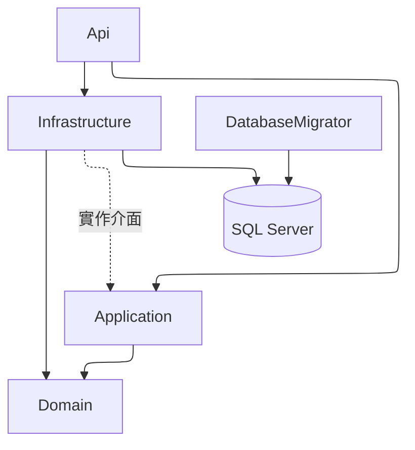

# MyWorkItem Backend 實作計劃與現況

## 文件狀態

- 基準分支：`dev2`
- 現況基準 Commit：`0f74ec3`
- 技術基線：.NET 10、ASP.NET Core Web API、Dapper、SqlKata、DbUp、SQL Server 2022
- 本文件用途：記錄已完成範圍、實際架構、驗收對照及剩餘風險，不再把已完成項目寫成未確認的預定方案。
- 正式來源：API 以 Controller／Contracts／OpenAPI 為準；Schema 以 Migration 為準；Runtime 以程式、Compose 與測試為準。

## 1. 範圍與產品規則

### 1.1 本 Repository 負責

- Authentication：CSRF、Login、Refresh、Logout、Me。
- JWT Access／Refresh Cookie、Refresh Rotation、Token Family 撤銷。
- Role／Function Authorization 與帳號狀態即時檢查。
- Work Item 列表、詳情、CRUD、可選指派、RowVersion、軟刪除及 History。
- 每位使用者獨立的單筆確認、撤銷與批次確認。
- Users、Roles、Functions 管理 API。
- DbUp Migration、Static Data、Development Seeder。
- Swagger／OpenAPI、ProblemDetails、CORS、Rate Limit、CSRF。
- Dockerfile、Compose、SQL Server、Init、Migrator 與 API 啟動鏈。
- UnitTests、IntegrationTests、WorkflowTests。

### 1.2 不在本 Repository 直接實作

- Vue 3 頁面、Router、Pinia、Checkbox UI 與提示訊息。
- Production Secret Store、TLS Termination、正式資料庫帳號與部署平台。
- Email、通知、附件、Work Item 多人指派或全域狀態機。

### 1.3 已確認規則

- 所有登入使用者可查看全部未軟刪除 Work Item。
- `AssignedUserId` 可為 `NULL`，只作顯示與篩選，不限制可見性或確認權。
- Checkbox 是前端暫存；後端只保存 Confirm。
- 個人狀態主鍵為 `(UserId, WorkItemId)`；Request 不接受確認者 `UserId`。
- Work Item 無全域 Status；Response 的 `StatusCode` 由目前使用者狀態衍生。
- 個人確認不寫入 Work Item History；CRUD 才保存 after-snapshot。

## 2. 實際 Solution 架構

```text
src/
├── MyWorkItem.Api              Controller、安全管線、Swagger、ProblemDetails
├── MyWorkItem.Application      Use Case 介面、DTO、驗證契約、Application Exception
├── MyWorkItem.Domain           Entity、Role／Function／Status／Action Constants
├── MyWorkItem.Infrastructure   Dapper、SqlKata、Service、JWT、Password、Connection Factory
└── MyWorkItem.DatabaseMigrator DbUp Runner 與 Development Seeder
tests/
├── MyWorkItem.UnitTests
├── MyWorkItem.IntegrationTests
└── MyWorkItem.WorkflowTests
database/
├── migrations                  不可變更的依序 Migration
└── scripts                     本機 SQL Login 初始化 Script
```

相依方向：



## 3. Database 基線

### 3.1 Migration

| 順序 | Script | 責任 | 狀態 |
| --- | --- | --- | --- |
| 001 | `001_InitialSchema.sql` | 12 張業務表、約束與 Index | 已實作 |
| 002 | `002_StaticData.sql` | Roles、Functions、Matrix、Statuses、Actions | 已實作 |

DbUp Journal 不計入業務 Schema。已套用的 Migration 不得修改；後續以 `003_...sql` 延伸。

### 3.2 Transaction Boundary

| 使用情境 | Transaction |
| --- | --- |
| 建立／修改／刪除 Work Item | Mutation 與 History after-snapshot 同一交易 |
| 批次確認 | 驗證全部 Work Item 後整批 Upsert，任一無效即 Rollback |
| Refresh | 舊 Token 檢查、輪替或 Family 撤銷同一交易 |
| 建立使用者 | User、Account、UserRoles 同一交易 |
| 覆寫角色／Functions | 停用舊關聯與新增關聯同一交易 |

### 3.3 目前限制

- `EnsureLocalLogin.sql` 為本機開發將 `myworkitem` 加入 `sysadmin`，Production 必須改成最小權限。
- Work Item History 尚無公開查詢 Endpoint，只保存於資料庫供稽核。
- Users 查詢目前回傳全部資料，尚未支援分頁、搜尋與排序。

## 4. Authentication 與安全性

### 4.1 Token 與 Cookie

- Access Token：15 分鐘，Cookie `mwi_access`。
- Refresh Token：7 天，Cookie `mwi_refresh`。
- Token Hash 保存於 `RefreshTokens`；Raw Token 不進資料庫或 Response DTO。
- Refresh 每次輪替；重播已撤銷 Token 時撤銷同一 Family。
- Development Cookie 可使用 HTTP；Production Cookie 為 Secure、HttpOnly、SameSite=Lax。

### 4.2 CSRF、CORS 與 Rate Limit

- `GET /api/v1/auth/csrf` 產生 `mwi_antiforgery` 與可讀的 `XSRF-TOKEN`。
- 所有 POST／PUT／PATCH／DELETE 必須送 `X-CSRF-TOKEN`。
- CORS 只允許 `Cors:AllowedOrigins` 並允許 Credentials，不允許 `*`。
- Authentication Controller 使用固定視窗：每分鐘 100 次、Queue 0。

### 4.3 權限 Matrix

| Function | Admin | Manager | Worker |
| --- | ---: | ---: | ---: |
| `WorkItems.Read` | ✓ | ✓ | ✓ |
| `WorkItems.Confirm` | ✓ | ✓ | ✓ |
| `WorkItems.Manage` | ✓ | ✓ |  |
| `Users.Manage` | ✓ | ✓ |  |
| `Roles.Manage` | ✓ |  |  |
| `Functions.Manage` | ✓ |  |  |

Authorization Handler 每個 Request 查詢目前資料庫，確保帳號停用與 Function 變更立即生效。

## 5. API 完成狀態

| 群組 | Endpoint 數 | 狀態 | 主要能力 |
| --- | ---: | --- | --- |
| Authentication | 5 | 已實作 | CSRF、Login、Refresh、Logout、Me |
| WorkItems | 9 | 已實作 | 分頁、使用者選項、詳情、CRUD、確認、批次 |
| Users | 7 | 已實作 | 查詢、建立、修改、啟停、重設密碼、角色 |
| Roles | 4 | 已實作 | 查詢、建立、修改、配置 Functions |
| Functions | 3 | 已實作 | 查詢、建立、修改 |
| Health | 1 | 已實作 | `/health` |

合計 28 個 Controller Endpoint，加上 Health 共 29 個。Swagger JSON 是可執行契約；手寫清單見 `docs/ApiList.md`。

## 6. Docker 與 IDE 流程

### 6.1 全 Docker

```text
.env
  → sqlserver（SA 初始化、具名 Volume）
  → sqlserver-init（建立／更新 myworkitem Login）
  → migrator（DbUp＋Development Seeder）
  → api（非 root，Host 5080）
```

### 6.2 Rider／dotnet run

1. Compose 啟動 `sqlserver`、`sqlserver-init`、`migrator`。
2. API 讀取 `appsettings.json`＋User Secrets。
3. User Secrets 保存完整 `myworkitem` 連線字串與 JWT Signing Key。
4. `http` Launch Profile 使用 `http://localhost:5170`。

`.env` 與 User Secrets 是兩套設定來源；IDE 不會自動讀取 `.env`。

## 7. Swagger／OpenAPI

- Development 預設啟用；Production 即使 `Swagger:Enabled=true` 仍不公開。
- 受保護端點標示 Cookie Authentication。
- Unsafe Endpoint 自動描述 `X-CSRF-TOKEN` Header。
- Swagger JavaScript 自動攜帶 same-origin Cookie、從 `XSRF-TOKEN` 加入 Header，Login 成功後重新取得 CSRF Token。
- Response Schema 不公開 Access Token、Refresh Token、PasswordHash 或 Token Hash。
- RowVersion 以 Base64 字串傳遞。

## 8. 測試計劃與對照

### 8.1 UnitTests

- DataAnnotations 契約：Login、Title、Batch 上限。
- Password Policy：至少 12 字元及四類中的三類。
- JWT Claims、Role／Function、Token 期限。
- 公開 Auth Response 不包含敏感 Token／Password 欄位。

### 8.2 IntegrationTests

- Testcontainers SQL Server＋DbUp 空資料庫建立。
- Seed Account Login、Schema、Static Data、OpenAPI 與 Swagger JavaScript。
- Production Swagger 不可存取。

### 8.3 WorkflowTests

- WF-01～WF-11 使用真實 HTTP Pipeline、CookieContainer、WebApplicationFactory 與 SQL Server Testcontainers。
- 不直接呼叫 Controller 或 Application Service。
- 測試矩陣見 `specs/001-myworkitem-backend/workflow-test-matrix.md`。

## 9. 完成與驗證關卡

每次交付至少執行：

```bash
dotnet restore
dotnet build --no-restore
dotnet test --no-build
dotnet format --verify-no-changes
docker compose --env-file .env.example config
```

涉及 Docker／Migration 時另驗證：

- SQL Server `healthy`。
- `sqlserver-init`、`migrator` Exit Code 0。
- `MyWorkItem` Database Online，Migration 重跑安全。
- API `/health` 200、Swagger JSON 可解析。
- 至少一條 CSRF → Login → 受保護 Request 的 Smoke Flow。

未執行或失敗的項目不得標示通過。

### 9.1 本次文件同步驗證（2026-08-04）

| 驗證 | 結果 |
| --- | --- |
| `dotnet restore` | 通過 |
| `dotnet build --no-restore` | 通過，0 Warning／0 Error |
| UnitTests | 通過，10／10 |
| IntegrationTests／WorkflowTests | 未完成；Docker Engine 無法連線，Testcontainers 在 Setup 階段失敗 |
| 不需 Docker 的 Production Swagger Test | 通過，1／1 |
| `dotnet format --verify-no-changes` | 通過 |
| `docker compose --env-file .env.example config` | 通過 |
| Mermaid | 19 個 Diagram 以 Mermaid CLI 11.16.0 渲染通過 |
| Draw.io | XML 結構驗證通過；本機無 Draw.io CLI，未執行 PNG／SVG 視覺輸出 |

因此本次可確認文件語法、專案建置、UnitTests 與 Compose 靜態契約；不可將 Integration／Workflow 或完整 Docker Runtime 標示為本次通過。

## 10. 後續改善清單

| 優先級 | 項目 | 原因 |
| --- | --- | --- |
| 高 | Production DB Login 改成最小權限 | 目前本機 `myworkitem` 是 `sysadmin` |
| 高 | 移除或強化固定短 Seed 密碼 | 僅適合 Development／Test |
| 中 | Users 列表加入分頁、搜尋與排序 | 與原規格完整度仍有落差 |
| 中 | 增加 Work Item History 查詢／稽核策略 | 現在只有寫入，沒有管理查詢 API |
| 中 | 增加 DB Health Check 與 Readiness | 現有 `/health` 只回 API Process 狀態 |
| 低 | 補齊更多 DTO XML Comment 與範例 | 改善 Swagger 可讀性 |
| 低 | 建立 Production Deployment 文件 | 本次只涵蓋本機 Docker 開發 |
