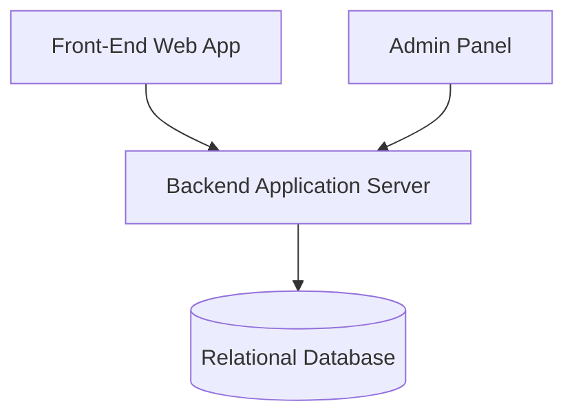

# My Work Item 開發需求

# 開發技術需求
1. 專案為ASP.NET Core Web API的專案
2. 專案的登入權限要有JWT的登入設計
3. 資料庫的ORM 要用Dapper搭配SqlKata的架構
4. 權限的設計部分，一個帳號有多個角色，每個角色可以有多個Function的功能
5. 撰寫測試案例時，請用Bogus產生模擬資料做單元測試
6. 單元測試使用Nunit搭配FluentAssertions進行撰寫
7. 需要DockerFile搭配MSSQL進行開發
8. 資料庫Schema要進入版本控制
9. WebAPI 要有CSRF的防護

## 產出物清單

| 項目 | 說明 |
| --- | --- |
| README.md | 啟動方式、Demo 路徑、帳號資料（若有需要） |
| 架構圖 | 建議 C4（Context／Container）或等價圖 |
| API 規格 | Swagger／Postman（若有 API） |
| DB 結構 | Table Schema 或 ERD 示意 |

# 需求

## Work Item List 應用程式開發

開發一個 **Web 應用程式**，其目的是允許 **前台使用者查看並操作 Work Item 列表（勾選、確認、查看詳情）**。每位使用者登入後，都能看到管理者所新增的 Work Item 列表，並針對每個項目進行 **個人化的勾選與確認操作**。換言之，勾選狀態僅針對該使用者本人保存，其他使用者登入時，仍會看到屬於自己尚未勾選的狀態，並能獨立操作。當使用者重新訪問時，系統需保持該使用者先前的勾選與確認狀態。

這個開發題圍繞一個名為「Work Item List」的網頁介面展開，前台使用者可以瀏覽並與列表互動，對 Work Item 進行勾選，並在按下「Confirm」（或類似按鈕）後，系統保存該使用者的操作紀錄。使用者可以關閉網頁後再登入，仍能看到自己之前的操作狀態。此外，使用者可點擊 Work Item 查看詳細資料。

後台則需要提供介面或 API，允許管理者新增、修改和刪除列表中的 Work Item。此專案的重點在於開發一個具有基本 CRUD（新增、讀取、更新、刪除）功能的 Web 應用程式，並支援前台使用者的個人化互動需求。應徵者需要同時考慮前台的呈現與使用者操作流程，以及後台資料的管理與持久化。

# User Stories

## 前台使用者

### 1. 查看 Work Item 列表

作為前台使用者，我想要在網頁上查看 Work Item 列表，以便了解有哪些待辦項目。

- **列表呈現**
  - 進入 `/work-items` 頁面時，能看到表格或清單，包含每個 Work Item 的「編號」、「標題」、「狀態」欄位。
  - 當資料庫中無任何項目時，顯示「目前無待辦項目」的提示文字。
- **欄位一致性**
  - 每筆資料要按照「新增時間」由新到舊排序（預設），且可切換升／降序。

### 2. 狀態切換（待確認 ↔ 已確認）

作為前台使用者，我想要勾選一或多個 Work Item 並按下「確認」以標記為已確認，或在需要時將其狀態改回待確認，以便正確記錄和調整我的操作。

- **多選功能**
  - 每列 Work Item 左側必須有一個勾選方塊（checkbox）。
  - 點擊任一勾選方塊後，該列背景或文字要顯示已選中狀態。
  - 表頭提供「全選」方塊，勾選後一次選中／取消選中所有顯示中的項目。
- **確認操作**
  - 當至少有一個勾選方塊被勾選時，「確認」按鈕才可點擊；否則為 disabled。
  - 點擊「確認」後，發送 API 請求，將我所勾選的項目狀態更新為「已確認」（僅針對我個人的紀錄）。
  - 更新完成後，清除所有勾選，並在表格上顯示對應列的「狀態」欄位變更為「已確認」。
- **撤銷操作**
  - 在列表中，僅對狀態為「已確認」的項目，顯示「撤銷確認」按鈕（或「標記為待確認」連結）。
  - 點擊「撤銷確認」後，跳出確認對話框：「確定要將此項目標記回『待確認』嗎？」
  - 提供「取消」與「確定」兩個選項；「取消」則不做任何變更。
  - 按「確定」後，發送 API 請求將該項目的狀態（僅針對我本人）更新為「待確認」。
  - 更新成功後，該列「狀態」欄位顯示「待確認」，並隱藏「撤銷確認」按鈕。
- **使用者反饋**
  - 更新成功後，顯示提示訊息（例如「已成功確認 X 項目」或「已將 X 項目標記為待確認」）。
  - 若更新失敗，顯示錯誤訊息並保留原狀態。

### 3. 保持操作狀態

作為前台使用者，我想要在重新訪問網頁時，看到我先前的操作狀態仍然保持，以便持續追蹤進度。

- **資料持久化**
  - 我的操作狀態必須儲存在後端，與其他使用者分開記錄。
- **重新載入**
  - 使用者關閉或重新整理瀏覽器後，再次打開 `/work-items`，已確認的項目仍顯示「已確認」，且勾選框為未勾選狀態。

### 4. 查看 Work Item 詳情

作為前台使用者，我想要點擊某個 Work Item 查看詳細資料，以便獲得該項目的更多資訊。

- **詳細頁面**
  - 在列表每列提供「查看詳情」按鈕或連結（可點擊整列亦可）。
  - 點擊後導向 `/work-items/{id}`，頁面展示該項目的「編號／標題／描述／建立時間／狀態／最後更新時間」等欄位。
- **返回列表**
  - 詳情頁提供「返回列表」連結或按鈕，點擊後回到先前的列表頁，並保持排序與分頁狀態。

## 後台管理員

### 5. 新增 Work Item

作為管理員，我想要新增 Work Item，以便在列表中加入新的待辦項目。

- **新增表單**
  - 管理後台提供 `/admin/work-items/new` 頁面，包含「標題」（必填）和「描述」（選填）欄位。
- **驗證規則**
  - 標題不得為空；若驗證失敗，顯示欄位錯誤提示並禁止提交。
- **提交行為**
  - 成功提交後，導回列表頁並顯示「新增成功」訊息，新項目出現在列表最上方（依排序規則）。

### 6. 修改 Work Item

作為管理員，我想要修改現有的 Work Item，以便更新或修正項目內容。

- **編輯介面**
  - 在管理列表每列提供「編輯」按鈕，點擊後到 `/admin/work-items/{id}/edit`，欄位預填當前標題與描述。
- **驗證規則**
  - 標題不得為空；若驗證失敗，顯示錯誤提示並禁止儲存。
- **提交行為**
  - 編輯後點擊「儲存」，更新成功則回列表並顯示「更新成功」提示，且該列顯示最新內容。

### 7. 刪除 Work Item

作為管理員，我想要刪除不再需要的 Work Item，以便保持列表乾淨且資訊正確。

- **刪除操作**
  - 每列提供「刪除」按鈕，點擊時跳出確認對話框：「確定要刪除此項目嗎？」
- **確認後行為**
  - 點擊「確定」後發送刪除請求，成功則該列從列表中移除，並顯示「刪除成功」訊息；若失敗，顯示錯誤提示並保留該列。

# 介面示意圖

原文件提供三個低擬真介面草圖：

1. **Work Item List（前台列表）**：呈現 Title、Status、每列 checkbox，以及 Confirm 按鈕。
2. **Work Item Detail（前台詳情）**：呈現 ID、Title、Description 與 Status。
3. **Admin Panel（後台管理）**：提供 Title、Description 輸入欄位、Save 按鈕，以及各項目的 Edit／Delete 操作。

| Work Item List | Work Item Detail | Admin Panel |
| --- | --- | --- |
| Title、Status | ID、Title | Title 輸入欄位 |
| 每列 checkbox | Description | Description 輸入欄位 |
| Pending 狀態 | Status：Pending | Save 按鈕 |
| Confirm 按鈕 |  | 各列 Edit／Delete 按鈕 |

# 系統架構示意圖

