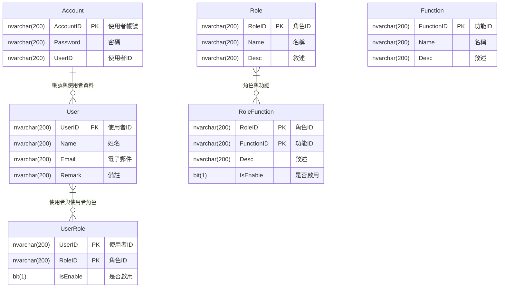
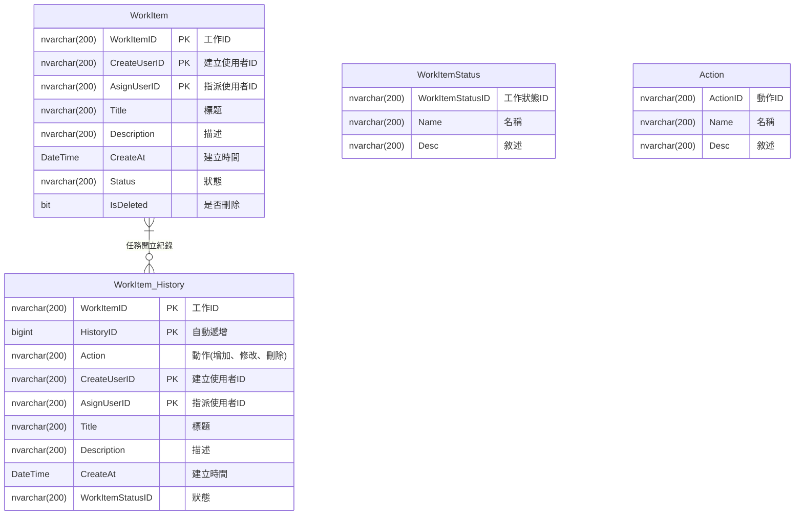

# 使用者模組

```mermaid
erDiagram
    Account{
       nvarchar(200)  AccountID PK "使用者帳號"
       nvarchar(200)  Password "密碼"
       nvarchar(200)  UserID "使用者ID"
    }

    User{
       nvarchar(200)  UserID PK "使用者ID"
       nvarchar(200)  Name "姓名"
       nvarchar(200)  Email "電子郵件"
       nvarchar(200)  Remark "備註"
    }

    Role{
       nvarchar(200)  RoleID PK "角色ID"
       nvarchar(200)  Name "名稱"
       nvarchar(200)  Desc "敘述"
    }

    UserRole{
       nvarchar(200)  UserID PK "使用者ID"
       nvarchar(200)  RoleID PK "角色ID"
       bit(1)        IsEnable "是否啟用"
    }

    RoleFunction{
       nvarchar(200)  RoleID PK "角色ID"
       nvarchar(200)  FunctionID PK "功能ID"
       nvarchar(200)  Desc "敘述"
       bit(1)         IsEnable "是否啟用"
    }

    Function{
      nvarchar(200)  FunctionID PK "功能ID"
      nvarchar(200)  Name           "名稱"
      nvarchar(200)  Desc           "敘述"
    }

    Account ||--o{ User : "帳號與使用者資料"
    User |{--o{ UserRole : "使用者與使用者角色"
    Role |{--o{ RoleFunction : "角色與功能"
```

# 表單模組

```mermaid
erDiagram
WorkItem{
      nvarchar(200)  WorkItemID PK   "工作ID"
      nvarchar(200)  CreateUserID PK "建立使用者ID"
      nvarchar(200)  AsignUserID PK  "指派使用者ID"
      nvarchar(200)  Title           "標題"
      nvarchar(200)  Description     "描述"
      DateTime      CreateAt        "建立時間"
      nvarchar(200)  Status          "狀態"
      bit           IsDeleted       "是否刪除"
}

WorkItem_History{
      nvarchar(200)  WorkItemID PK   "工作ID"
      bigint HistoryID PK           "自動遞增"
      nvarchar(200)  Action          "動作(增加、修改、刪除)"
      nvarchar(200)  CreateUserID PK "建立使用者ID"
      nvarchar(200)  AsignUserID PK  "指派使用者ID"
      nvarchar(200)  Title           "標題"
      nvarchar(200)  Description     "描述"
      DateTime      CreateAt        "建立時間"
      nvarchar(200)  WorkItemStatusID"狀態"
}

WorkItemStatus{
    nvarchar(200)  WorkItemStatusID "工作狀態ID"
    nvarchar(200)  Name             "名稱"
    nvarchar(200)  Desc             "敘述"
}

Action{
    nvarchar(200)  ActionID "動作ID"
    nvarchar(200)  Name     "名稱"
    nvarchar(200)  Desc      "敘述"
}

WorkItem |{--o{ WorkItem_History : 任務開立紀錄


```
