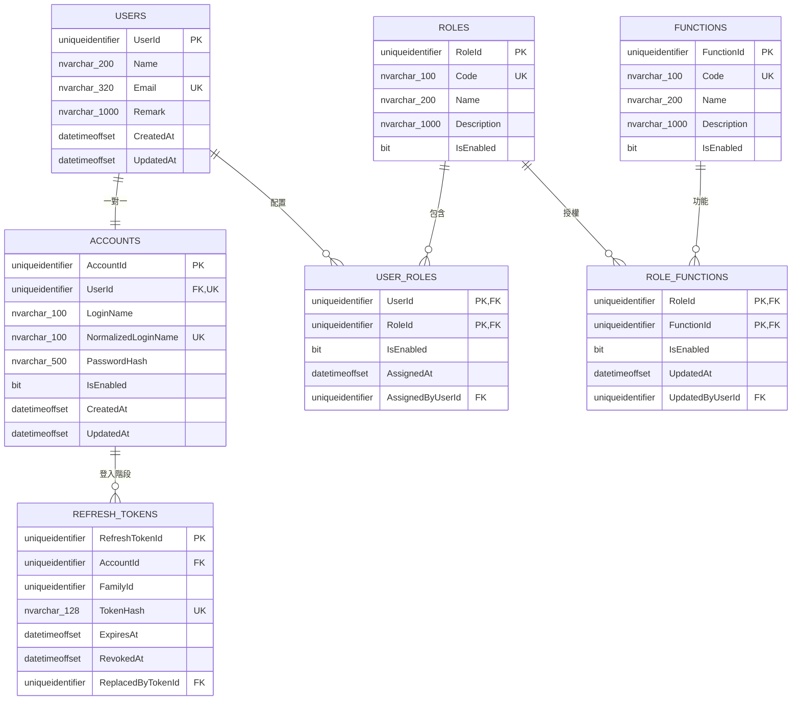
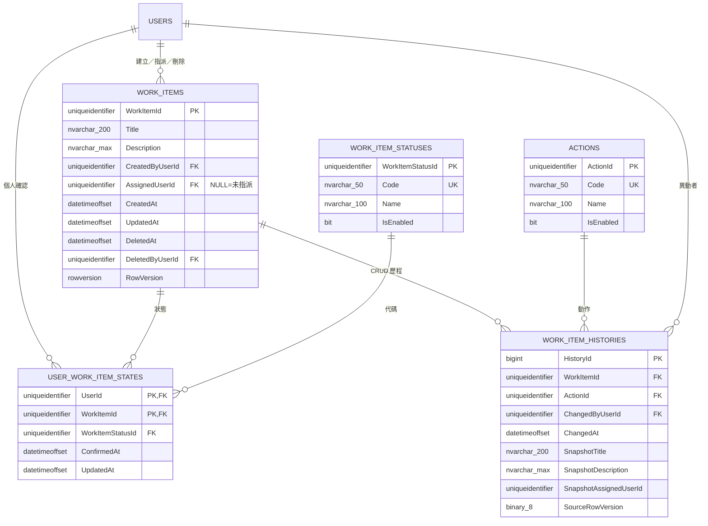

# Schema V1.1（已實作基線）

## 文件狀態

本文件是原始 Schema 草圖經需求確認後的實作對照。原始草圖仍保留於 Repository 根目錄 `Schema.md`，正式 DDL 以 `database/migrations/` 為準。

已確認的修正：

- ID 統一為 `uniqueidentifier`，不使用 `nvarchar(200)` 作主鍵。
- `Users` 與 `Accounts` 為一對一，角色配置歸屬 `Users`。
- 原 `UserFunction` 語意修正為 `RoleFunctions`。
- `WorkItemId` 是 Work Item 唯一主鍵；建立者與指派者是 FK，不是複合主鍵。
- `AssignedUserId` 可為 `NULL`，且不限制其他使用者查看或確認。
- 個人確認獨立保存於 `UserWorkItemStates`，不使用 Work Item 全域狀態。
- Work Item 使用 `DeletedAt`／`DeletedByUserId` 軟刪除，不保留 `IsDeleted`。
- Work Item CRUD 以 `WorkItemHistories` 保存 after-snapshot；個人確認不寫入該歷程。

## 身分與權限 Schema

## Work Item Schema

## 正規化與一致性審查

- 欄位皆保存不可再分割的單值，符合 1NF。
- `UserRoles`、`RoleFunctions`、`UserWorkItemStates` 的非鍵欄位依賴完整複合主鍵，未發現 Partial Dependency，符合 2NF。
- LoginName／Email 另存 Normalized 值支援不分大小寫唯一性；這是受控衍生資料。
- `WorkItemHistories` 刻意反正規化保存完整快照，用於稽核與還原判讀，不作目前狀態查詢來源。
- 所有 FK 使用 SQL Server 預設 `NO ACTION`，避免 Cascade Delete 誤刪稽核與關聯資料。
- `CK_WorkItems_DeletedPair` 確保軟刪除時間與刪除者同時為 NULL 或同時有值。
- CRUD、History、批次確認、Refresh Rotation 與權限覆寫分別定義 Transaction Boundary。

## Index 基線

- `UX_Users_NormalizedEmail`
- `UX_Accounts_NormalizedLoginName`、`UX_Accounts_UserId`
- `IX_UserRoles_RoleId`、`IX_RoleFunctions_FunctionId`
- `IX_RefreshTokens_AccountFamily`、`IX_RefreshTokens_FamilyId`
- `IX_WorkItems_Active_CreatedAt`、`IX_WorkItems_AssignedUserId`
- `IX_UserWorkItemStates_WorkItemId`
- `IX_WorkItemHistories_WorkItemChangedAt`

任何後續 Schema 變更必須新增 Migration，不得修改已套用的 `001`／`002`。
