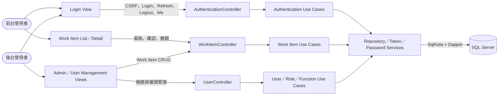
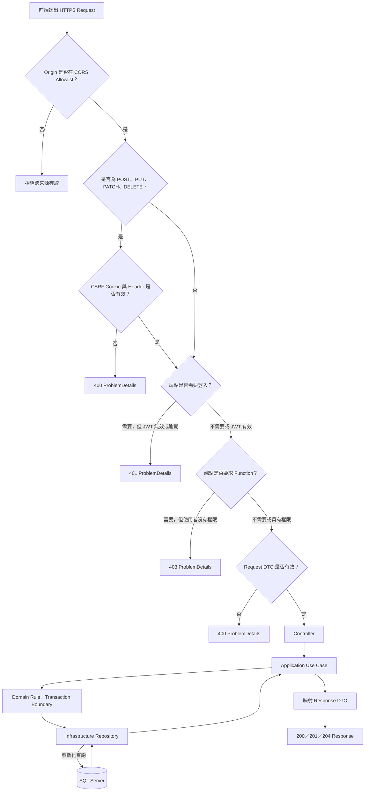
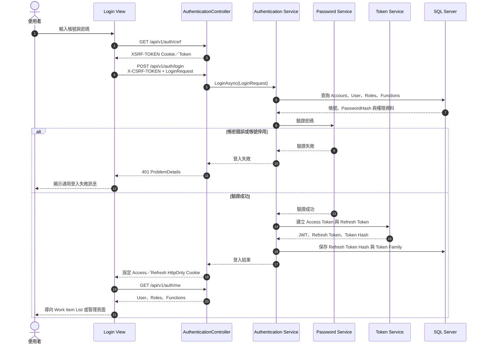
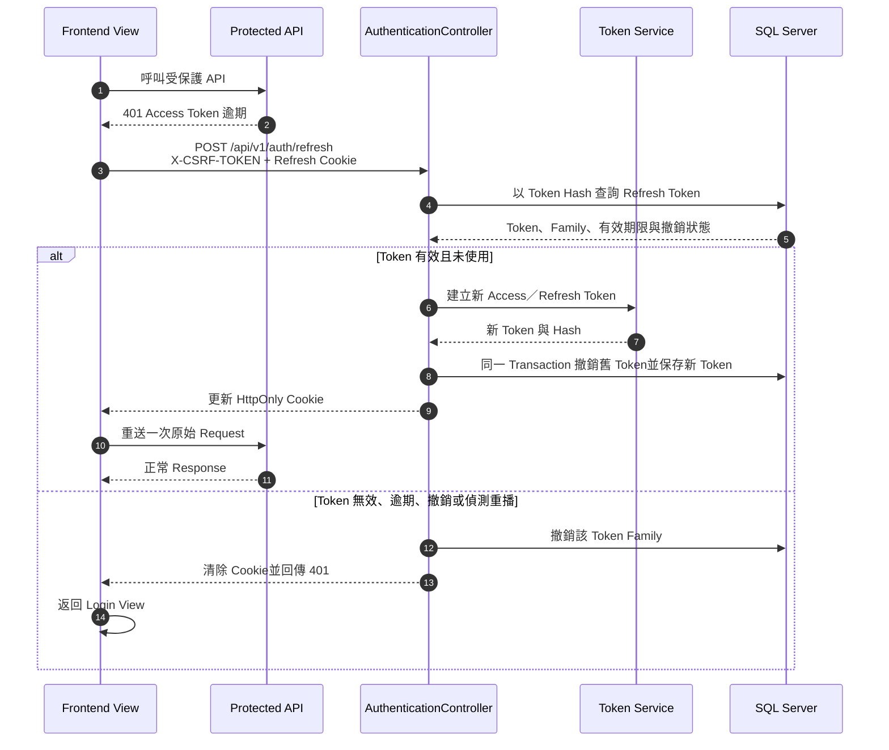
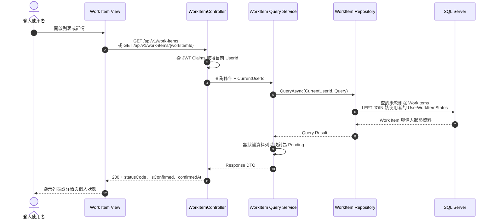
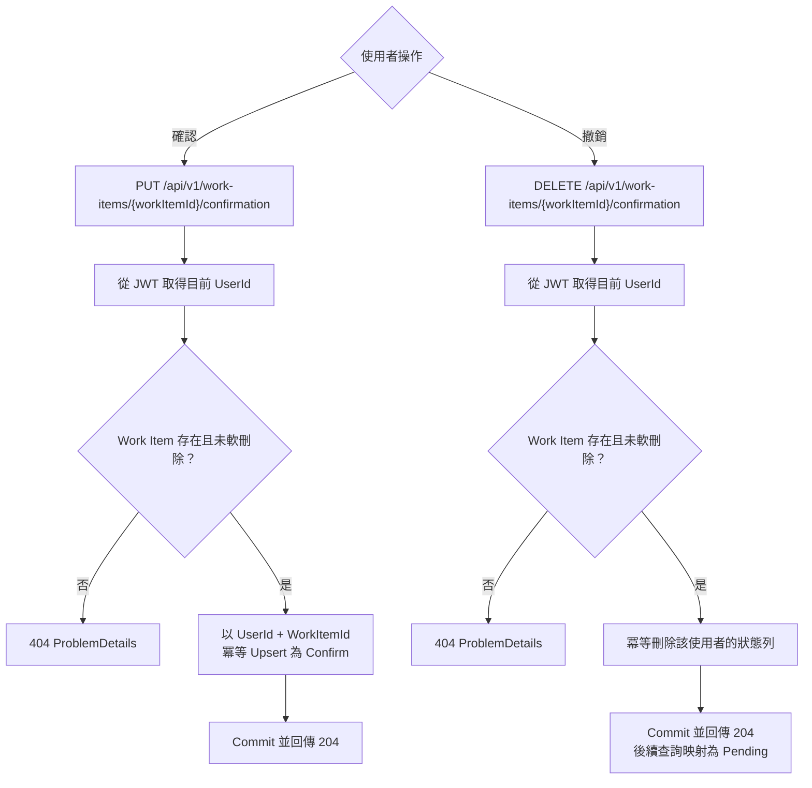
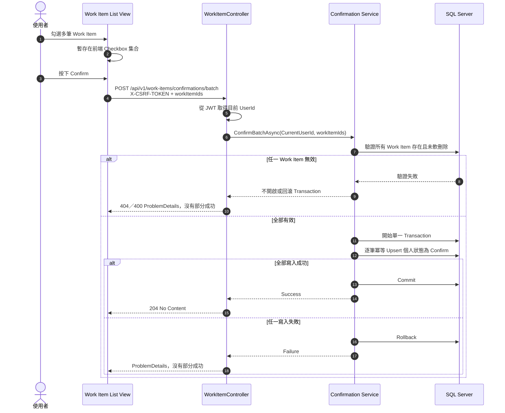
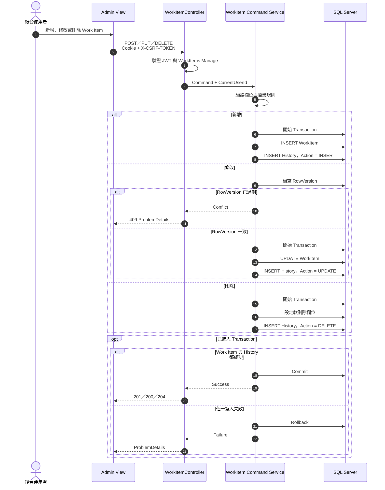
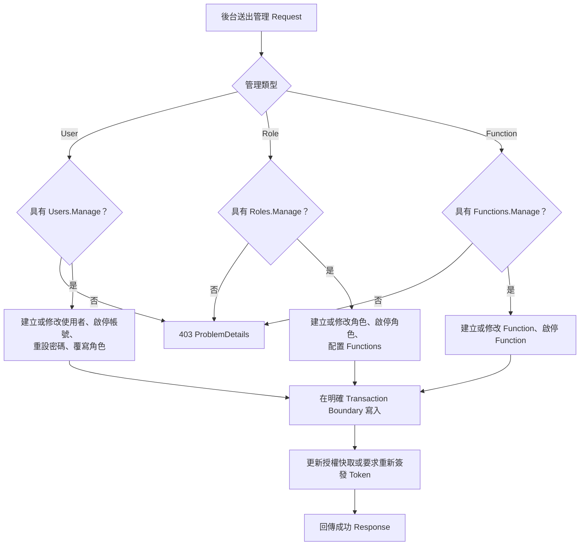
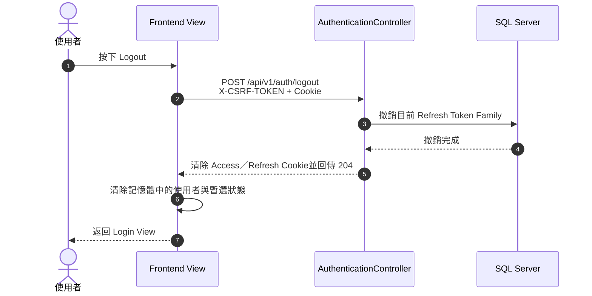

# MyWorkItem Backend Runtime Workflow（Draft）

## 文件目的

本文件只描述系統實作完成後，程式在執行期間的實際流程，包括 HTTP Request Pipeline、
登入與 Token、Work Item 查詢、個人確認、管理端 CRUD，以及使用者與權限管理。

- 本文件不包含開發階段、Schema 審查、建置、測試或 Docker 啟動流程。
- Login View 與 Work Item Views 位於獨立前端專案；本 Repository 實作後端 API。
- `AuthenticationController` 獨立處理登入工作階段，不與 `UserController` 混用。
- 本文件仍是 Draft；資料表與狀態代碼需以最後核准的 Schema 為準。

## 1. 系統整體 Runtime Workflow

## 2. HTTP Request Pipeline

每個 API Request 都先通過共用 Pipeline；Controller 只負責 HTTP 邊界，不直接執行 SQL
或放置商業規則。

未預期例外由全域 Exception Handler 記錄安全日誌並回傳 `500 ProblemDetails`；Response 不得
包含 Stack Trace、SQL、Cookie、Token 或其他敏感資料。

## 3. 登入 Workflow

## 4. Access Token Refresh Workflow

Refresh 由前端在受保護 API 回傳 401 後受控觸發，原始 Request 最多重送一次，避免無限循環。

## 5. Work Item 列表與詳情 Workflow

所有登入使用者取得相同的有效 Work Item；個人確認狀態只能由 JWT 中的 UserId 決定，
API 不接受前端傳入其他 UserId。

## 6. 個人確認 Workflow

Checkbox 是前端暫選狀態，不寫入後端。只有使用者按下 Confirm 後，後端才保存個人狀態。

### 6.1 單筆確認與撤銷

### 6.2 批次確認

## 7. 管理端 Work Item CRUD Workflow

管理端 Request 必須同時通過 JWT、CSRF 與 `WorkItems.Manage` Function 驗證。

## 8. 使用者與權限管理 Workflow

本流程供具有對應 Manage Function 的後台使用者操作。若最終 MVP 縮小範圍，Roles 與
Functions 可改為唯讀種子資料，但授權判斷流程不變。

## 9. Logout Workflow

## 10. 主要 Runtime 規則

1. 使用者身分只來自驗證後的 JWT，API 不接受前端指定其他 `UserId`。
2. 所有登入使用者看到相同的有效 Work Item，個人確認狀態以
   `(UserId, WorkItemId)` 隔離。
3. 沒有個人狀態資料列時回傳 `Pending`；確認後保存為 `Confirm`。
4. Checkbox 暫選狀態只存在前端，不進入資料庫。
5. 所有寫入 Request 必須通過 CSRF 驗證。
6. 批次確認使用單一 Transaction，不允許部分成功。
7. Work Item 採軟刪除；一般列表與詳情排除已刪除資料。
8. Work Item 修改使用 RowVersion；並行衝突回傳 409。
9. Work Item CRUD 與 History 必須在同一 Transaction 完成。
10. API 錯誤統一使用 ProblemDetails，並明確區分 400、401、403、404、409、500。
