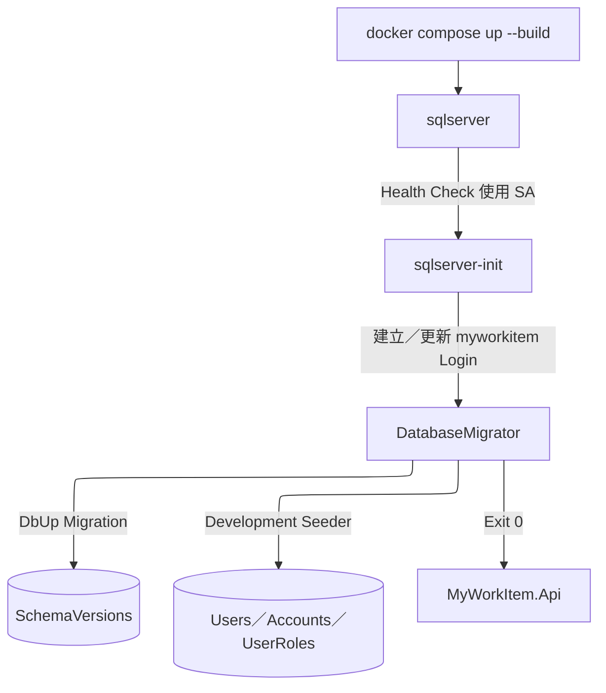
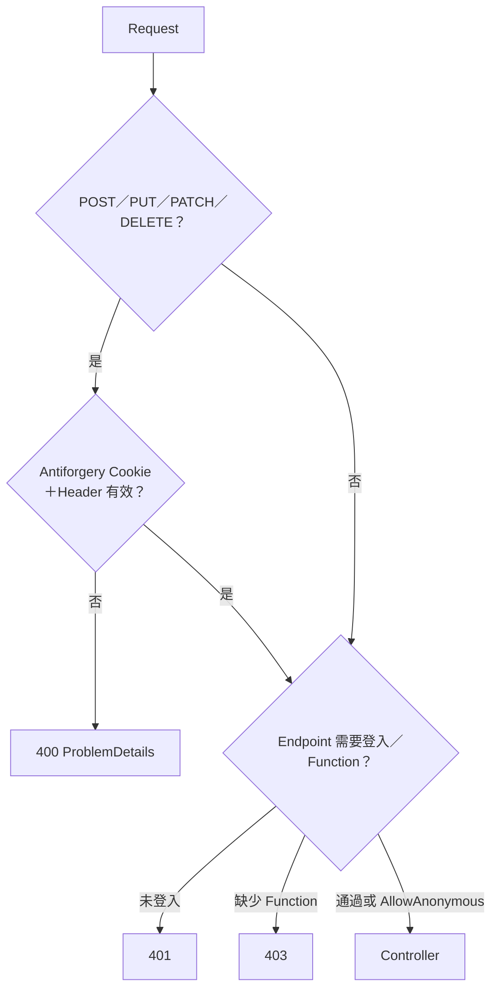
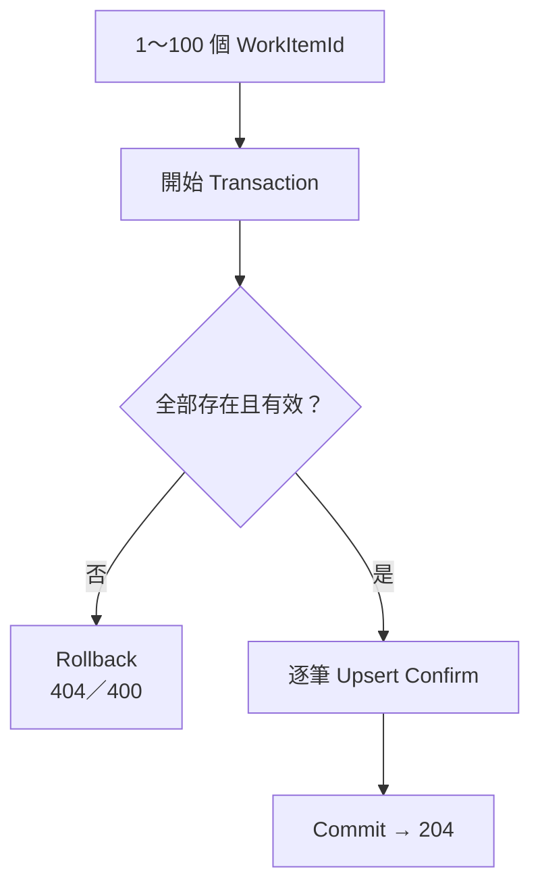

# MyWorkItem Backend 實際 Runtime Workflow

## 文件目的

本文件對照目前程式碼，描述 Request 進入 API 後實際經過的元件、資料操作與 Transaction。視覺化摘要見 `docs/RuntimeWorkflow.md`；測試對照見 WorkflowTests。

## 1. Infrastructure Startup



- SQL Server 使用 `sqlserver-data` 具名 Volume。
- API／Migrator 使用 `myworkitem` Login；`sa` 不進應用程式連線字串。
- 任一依賴服務失敗，後續服務不應啟動。

## 2. HTTP Pipeline

實際 Middleware 順序：

```text
ExceptionHandler
→ StaticFiles
→ CORS
→ RateLimiter
→ Authentication（JWT from mwi_access Cookie）
→ CsrfValidationMiddleware
→ Authorization（Function Requirement）
→ Controller
```

Decision：



## 3. Login

1. Client 呼叫 `GET /api/v1/auth/csrf`。
2. ASP.NET Core 產生 HttpOnly `mwi_antiforgery` 與前端可讀 `XSRF-TOKEN`。
3. Client 將 `XSRF-TOKEN` 放進 `X-CSRF-TOKEN`，呼叫 `POST /auth/login`。
4. `AuthenticationService` 依 Normalized LoginName 查詢 `Accounts`＋`Users`。
5. 確認 Account 啟用，使用 `PasswordHasher` 驗證 Hash。
6. 查詢啟用 Role 與 Function 聯集，建立 JWT Claims。
7. 產生 Access Token、Refresh Token 與 FamilyId；只保存 Refresh Token Hash。
8. Controller 設定 `mwi_access`、`mwi_refresh` HttpOnly Cookie。
9. Client 再取得一次 CSRF Token，讓 Antiforgery Token 綁定已登入 Claims。

錯誤：帳號不存在、停用或密碼錯誤均回 401，不暴露是哪一項錯誤。

## 4. Refresh 與 Logout

### Refresh

1. CSRF Middleware 先驗證 unsafe Request。
2. 從 `mwi_refresh` Cookie 取得 Raw Token並計算 Hash。
3. 在 Transaction 中鎖定／查詢 Refresh Token。
4. Token 有效時撤銷舊 Token、建立同 Family 的新 Token並 Commit。
5. Token 已撤銷或被重播時撤銷整個 Family並 Commit，回 401。
6. 成功時覆寫 Access／Refresh Cookie。

### Logout

1. 驗證 CSRF。
2. 依 Refresh Token 找到 Family，撤銷未失效 Token。
3. 清除 Access／Refresh Cookie並回 204。

## 5. Work Item Query

1. JWT Authentication 取得 AccountId／UserId。
2. Function Handler 即時驗證 `WorkItems.Read`。
3. 驗證 `page >= 1`、`pageSize 1..100`、`sortDirection asc|desc`。
4. SqlKata 組合有效 Work Item、Keyword、AssignedUserId、排序與分頁查詢。
5. Left Join 目前使用者的 `UserWorkItemStates`。
6. Dapper 執行並映射 `WorkItemResponse`。
7. 無 State Row 時回 `Pending`／`isConfirmed=false`；有 Confirm Row 時附上 `confirmedAt`。

所有登入使用者查詢相同的有效 Work Item 集合，只有個人狀態不同。

## 6. 個人確認

### 單筆確認

- 驗證 Work Item 存在且未軟刪除。
- 以目前 JWT UserId 與 WorkItemId Upsert `UserWorkItemStates`。
- 重複確認維持 Confirm，屬冪等操作。

### 撤銷

- 驗證 Work Item 存在且未軟刪除。
- 刪除目前 UserId＋WorkItemId 的 State Row。
- Row 不存在仍回 204，屬冪等操作。

### 批次確認



API 不接受 UserId，避免替其他使用者操作。

## 7. Work Item CRUD 與 History

### Create

1. 驗證 `WorkItems.Manage`、Title 與可選 AssignedUserId。
2. 指派者存在但帳號停用時拒絕。
3. Transaction 內新增 Work Item。
4. 讀回 RowVersion，寫入 `INSERT` after-snapshot History。
5. Commit，回 201。

### Update

1. 將 Request Base64 RowVersion 轉成 8 bytes。
2. Transaction 內以 `WorkItemId + RowVersion + DeletedAt IS NULL` 更新。
3. 影響 0 Row 時區分 Not Found 與 Concurrency Conflict；衝突回 409。
4. 讀回新 RowVersion，寫入 `UPDATE` after-snapshot後 Commit。

### Delete

1. Transaction 內設定 `DeletedAt`、`DeletedByUserId`。
2. 已刪除或不存在回 404。
3. 寫入含刪除欄位的 `DELETE` after-snapshot後 Commit。
4. 一般列表與詳情以 `DeletedAt IS NULL` 排除該項目。

## 8. Users／Roles／Functions

- Users：建立 User＋Account＋Role；修改個資；啟停；重設密碼並撤銷 Refresh Token；覆寫 Roles。
- Roles：查詢、建立、修改名稱／描述／狀態、覆寫 Functions。
- Functions：查詢、建立、修改名稱／描述／狀態。
- Role／Function Code 建立後不可修改。
- Manager 可管理 Users；只有 Admin 可管理 Roles／Functions。
- 權限異動後不需重新簽發 Access Token，下一個 Request 的 Function Handler 會查詢最新資料庫狀態。

## 9. ProblemDetails 對照

| Status | 來源 |
| --- | --- |
| 400 | DataAnnotations、Application Validation、CSRF |
| 401 | JWT 無效、登入失敗、Refresh 無效 |
| 403 | 缺少 Function |
| 404 | 資源不存在或已軟刪除 |
| 409 | 唯一鍵、RowVersion、資料衝突 |
| 429 | Authentication Rate Limit |
| 500 | 未預期例外；不回傳 Stack Trace／SQL |

## 10. Workflow Test Mapping

WF-01～WF-11 必須透過真實 HTTP Pipeline、CookieContainer、WebApplicationFactory 與 SQL Server Testcontainers 驗證。不得用直接呼叫 Controller／Service 取代 Runtime Workflow 驗收。
