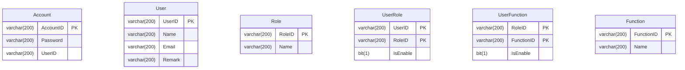
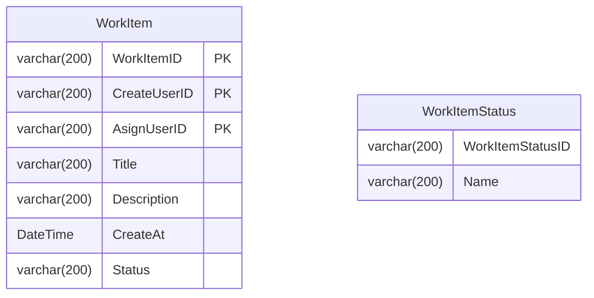

# 使用者模組

```mermaid
erDiagram
    Account{
       varchar(200)  AccountID PK
       varchar(200)  Password
       varchar(200)  UserID
    }

    User{
       varchar(200)  UserID PK
       varchar(200)  Name
       varchar(200)  Email
       varchar(200)  Remark
    }

    Role{
       varchar(200)  RoleID PK
       varchar(200)  Name
    }

    UserRole{
       varchar(200)  UserID PK
       varchar(200)  RoleID PK
       bit(1)        IsEnable
    }

    UserFunction{
       varchar(200)  RoleID PK
       varchar(200)  FunctionID PK
       bit(1)        IsEnable
    }

    Function{
      varchar(200)  FunctionID PK
      varchar(200)  Name
    }
```

# 表單模組

```mermaid
erDiagram
WorkItem{
      varchar(200)  WorkItemID PK
      varchar(200)  CreateUserID PK
      varchar(200)  AsignUserID PK
      varchar(200)  Title
      varchar(200)  Description
      DateTime      CreateAt
      varchar(200)  Status
}

WorkItemStatus{
    varchar(200)  WorkItemStatusID
    varchar(200)  Name
}
```
