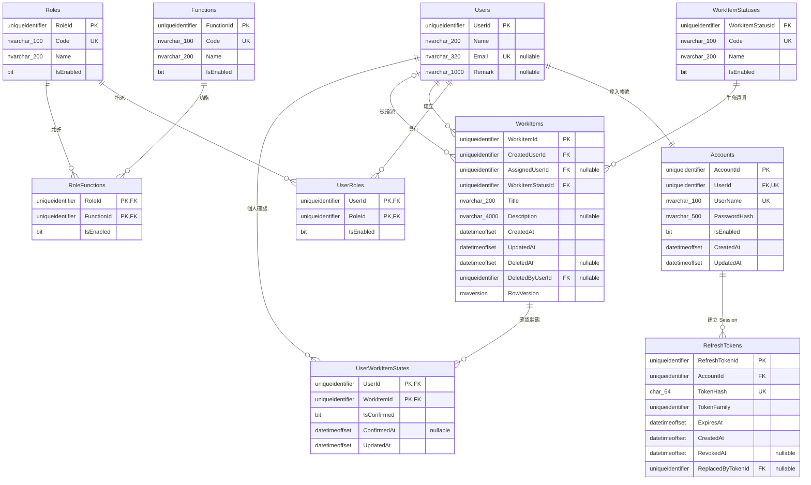

# MyWorkItem 資料庫 Schema

實際資料庫版本以
[`src/MyWorkItem.DatabaseMigrator/Scripts/`](../src/MyWorkItem.DatabaseMigrator/Scripts/)
內依序編號的 DbUp Migration 為準。本版已對齊 `draft/Schema.md`，並保留密碼安全、
Session、稽核、並行控制與多使用者個人確認狀態。

## 草稿對齊決策

| 草稿概念 | 正式設計 | 原因 |
| --- | --- | --- |
| `Account.UserID` | `Accounts.UserId` 一對一 FK | 依草稿由帳號指向使用者 |
| `Account.Password` | `Accounts.PasswordHash` | 禁止保存明碼密碼 |
| `UserRole` | `UserRoles(UserId, RoleId, IsEnabled)` | 角色直接指派給使用者，並可停用單一關聯 |
| `RoleFunction.IsEnable` | `RoleFunctions.IsEnabled` | 可停用單一角色權限關聯 |
| `WorkItem.CreateUserID` | `WorkItems.CreatedUserId` | FK 指向實際建立者 |
| `WorkItem.AsignUserID` | `WorkItems.AssignedUserId` | 修正拼字；允許空值代表開放所有使用者 |
| `WorkItem.Status` | `WorkItems.WorkItemStatusId` | 使用 `WorkItemStatuses` 主檔維護項目生命週期 |
| 三個 Work Item 欄位皆標 PK | 只有 `WorkItemId` 是 PK | 建立者與指派者是關聯，不應成為主鍵 |

`WorkItemStatuses` 描述項目本身的 `Active`／`Closed` 生命週期；使用者個人的
「待確認／已確認」仍由 `UserWorkItemStates` 保存，避免某位使用者的操作影響他人。

## ERD

## 資料表摘要

| Table | 主鍵 | 用途 |
| --- | --- | --- |
| `Users` | `UserId` | 姓名、Email 與備註 |
| `Accounts` | `AccountId` | 登入帳號、密碼雜湊與啟用狀態 |
| `Roles` | `RoleId` | 角色主檔 |
| `Functions` | `FunctionId` | 細粒度 Function 權限主檔 |
| `UserRoles` | `(UserId, RoleId)` | 使用者角色關聯及單筆啟用狀態 |
| `RoleFunctions` | `(RoleId, FunctionId)` | 角色功能關聯及單筆啟用狀態 |
| `WorkItemStatuses` | `WorkItemStatusId` | Work Item 生命週期主檔 |
| `WorkItems` | `WorkItemId` | 內容、建立／指派使用者、生命週期、軟刪除與版本 |
| `UserWorkItemStates` | `(UserId, WorkItemId)` | 每位使用者獨立的確認狀態 |
| `RefreshTokens` | `RefreshTokenId` | Refresh Token 輪替與撤銷 |

## 重要約束

### 使用者與權限

- `Accounts.UserId` 為 Unique FK，確保一位使用者最多一個登入帳號。
- `UserRoles.IsEnabled = 0` 時，登入授權不載入該角色。
- `RoleFunctions.IsEnabled = 0` 時，JWT 不包含該 Function。
- `Roles`、`Functions` 本身仍有 `IsEnabled`，主檔與關聯任一停用都不授權。

### Work Item

- `CreatedUserId` 必填；`AssignedUserId` 可空，空值代表未限定單一使用者。
- `WorkItemStatusId` 必填，Migration 預建 `Active` 與 `Closed`。
- `DeletedAt`／`DeletedByUserId` 用於軟刪除稽核。
- `RowVersion` 由 SQL Server 產生，API 以 Base64 `version` 做樂觀並行控制。
- `UserWorkItemStates` 的複合主鍵確保同一使用者對同一項目只有一筆狀態。

## Migration

| Script | 說明 |
| --- | --- |
| `001_InitialSchema.sql` | 建立初始帳號、權限、Session、Work Item 與個人確認結構 |
| `002_AlignDraftSchema.sql` | 對齊草稿：帳號改由 `UserId` 關聯、建立 `UserRoles`、加入關聯啟用旗標、Work Item 建立／指派使用者與狀態主檔 |

- 已套用的 Migration 不直接修改；所有升級由 DbUp 依序執行。
- 升級 Script 先搬移既有角色、建立者與刪除者資料，再移除舊欄位與 `AccountRoles`。
- 所有時間使用 UTC `datetimeoffset(7)`；文字欄位使用 Unicode `nvarchar`。
- DbUp 的 `SchemaVersions` Journal Table 只記錄 Migration，不屬於業務模型。
