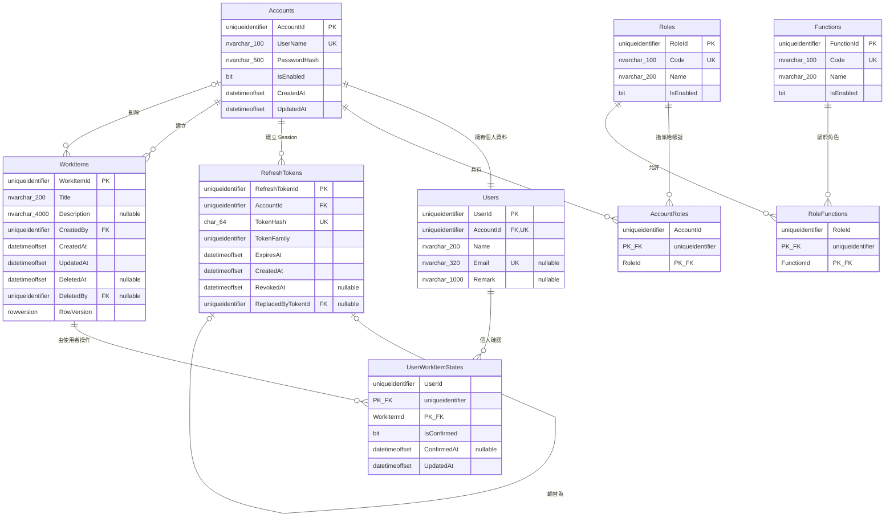

# MyWorkItem 資料庫 Schema

實際資料庫版本以
[`src/MyWorkItem.DatabaseMigrator/Scripts/`](../src/MyWorkItem.DatabaseMigrator/Scripts/)
內依序編號的 DbUp SQL Migration 為準。本文件提供 ERD、資料表欄位與重要約束的
閱讀版本。

## ERD

## 資料表摘要

| Table | 主鍵 | 用途 |
| --- | --- | --- |
| `Accounts` | `AccountId` | 登入帳號、密碼雜湊與啟用狀態 |
| `Users` | `UserId` | 與 Account 一對一的個人資料 |
| `Roles` | `RoleId` | 角色定義 |
| `Functions` | `FunctionId` | 細粒度 Function 權限定義 |
| `AccountRoles` | `(AccountId, RoleId)` | 帳號與角色多對多關聯 |
| `RoleFunctions` | `(RoleId, FunctionId)` | 角色與 Function 多對多關聯 |
| `RefreshTokens` | `RefreshTokenId` | Refresh Token Hash、輪替及撤銷狀態 |
| `WorkItems` | `WorkItemId` | Work Item 內容、稽核、軟刪除與並行版本 |
| `UserWorkItemStates` | `(UserId, WorkItemId)` | 每位使用者獨立的 Work Item 確認狀態 |

DbUp 另外建立 `SchemaVersions` Journal Table，記錄已執行的 Migration Script；該表由
DbUp 管理，不屬於業務模型。

## Table Schema

### Accounts

| Column | Type | Null | 說明 |
| --- | --- | --- | --- |
| `AccountId` | `uniqueidentifier` | 否 | PK |
| `UserName` | `nvarchar(100)` | 否 | UK，登入名稱 |
| `PasswordHash` | `nvarchar(500)` | 否 | ASP.NET Core PasswordHasher 雜湊，不保存明碼 |
| `IsEnabled` | `bit` | 否 | 預設 `1` |
| `CreatedAt` | `datetimeoffset(7)` | 否 | UTC 建立時間 |
| `UpdatedAt` | `datetimeoffset(7)` | 否 | UTC 更新時間 |

### Users

| Column | Type | Null | 說明 |
| --- | --- | --- | --- |
| `UserId` | `uniqueidentifier` | 否 | PK |
| `AccountId` | `uniqueidentifier` | 否 | FK → `Accounts.AccountId`，並有 UK 確保一對一 |
| `Name` | `nvarchar(200)` | 否 | 顯示名稱 |
| `Email` | `nvarchar(320)` | 是 | Filtered Unique Index，非空值不可重複 |
| `Remark` | `nvarchar(1000)` | 是 | 備註 |

### Roles

| Column | Type | Null | 說明 |
| --- | --- | --- | --- |
| `RoleId` | `uniqueidentifier` | 否 | PK |
| `Code` | `nvarchar(100)` | 否 | UK，穩定角色代碼 |
| `Name` | `nvarchar(200)` | 否 | 顯示名稱 |
| `IsEnabled` | `bit` | 否 | 預設 `1` |

### Functions

| Column | Type | Null | 說明 |
| --- | --- | --- | --- |
| `FunctionId` | `uniqueidentifier` | 否 | PK |
| `Code` | `nvarchar(100)` | 否 | UK，例如 `WorkItems.Read` |
| `Name` | `nvarchar(200)` | 否 | 顯示名稱 |
| `IsEnabled` | `bit` | 否 | 預設 `1` |

### AccountRoles

| Column | Type | Null | 說明 |
| --- | --- | --- | --- |
| `AccountId` | `uniqueidentifier` | 否 | PK、FK → `Accounts.AccountId` |
| `RoleId` | `uniqueidentifier` | 否 | PK、FK → `Roles.RoleId` |

### RoleFunctions

| Column | Type | Null | 說明 |
| --- | --- | --- | --- |
| `RoleId` | `uniqueidentifier` | 否 | PK、FK → `Roles.RoleId` |
| `FunctionId` | `uniqueidentifier` | 否 | PK、FK → `Functions.FunctionId` |

### RefreshTokens

| Column | Type | Null | 說明 |
| --- | --- | --- | --- |
| `RefreshTokenId` | `uniqueidentifier` | 否 | PK |
| `AccountId` | `uniqueidentifier` | 否 | FK → `Accounts.AccountId` |
| `TokenHash` | `char(64)` | 否 | UK，只保存 SHA-256 Hex，不保存原始 Token |
| `TokenFamily` | `uniqueidentifier` | 否 | 同一登入 Session 的輪替族群 |
| `ExpiresAt` | `datetimeoffset(7)` | 否 | 到期時間 |
| `CreatedAt` | `datetimeoffset(7)` | 否 | 建立時間 |
| `RevokedAt` | `datetimeoffset(7)` | 是 | 撤銷時間 |
| `ReplacedByTokenId` | `uniqueidentifier` | 是 | Self FK → `RefreshTokens.RefreshTokenId` |

Index：`IX_RefreshTokens_Family(TokenFamily)`。

### WorkItems

| Column | Type | Null | 說明 |
| --- | --- | --- | --- |
| `WorkItemId` | `uniqueidentifier` | 否 | PK |
| `Title` | `nvarchar(200)` | 否 | 標題 |
| `Description` | `nvarchar(4000)` | 是 | 詳細內容 |
| `CreatedBy` | `uniqueidentifier` | 否 | FK → `Accounts.AccountId` |
| `CreatedAt` | `datetimeoffset(7)` | 否 | 建立時間 |
| `UpdatedAt` | `datetimeoffset(7)` | 否 | 更新時間 |
| `DeletedAt` | `datetimeoffset(7)` | 是 | 不為空表示已軟刪除 |
| `DeletedBy` | `uniqueidentifier` | 是 | FK → `Accounts.AccountId` |
| `RowVersion` | `rowversion` | 否 | 樂觀並行控制；API 以 Base64 `version` 傳遞 |

Index：`IX_WorkItems_ActiveCreatedAt(DeletedAt, CreatedAt DESC)`。

### UserWorkItemStates

| Column | Type | Null | 說明 |
| --- | --- | --- | --- |
| `UserId` | `uniqueidentifier` | 否 | PK、FK → `Users.UserId` |
| `WorkItemId` | `uniqueidentifier` | 否 | PK、FK → `WorkItems.WorkItemId` |
| `IsConfirmed` | `bit` | 否 | 是否已確認 |
| `ConfirmedAt` | `datetimeoffset(7)` | 是 | 最近確認時間；撤銷後為空 |
| `UpdatedAt` | `datetimeoffset(7)` | 否 | 最近狀態更新時間 |

複合主鍵確保同一使用者對同一 Work Item 只有一筆狀態。Work Item 軟刪除後保留此紀錄
供稽核，不做 Cascade Delete。

## Migration 規則

- Migration 使用遞增編號，例如 `001_InitialSchema.sql`。
- 已套用的 Migration 不得直接修改；Schema 變更應新增下一支 Script。
- API 啟動不自行修改 Schema；由 `MyWorkItem.DatabaseMigrator` 負責 DbUp。
- 所有時間使用 UTC `datetimeoffset(7)`，所有文字欄位使用 Unicode `nvarchar`。
