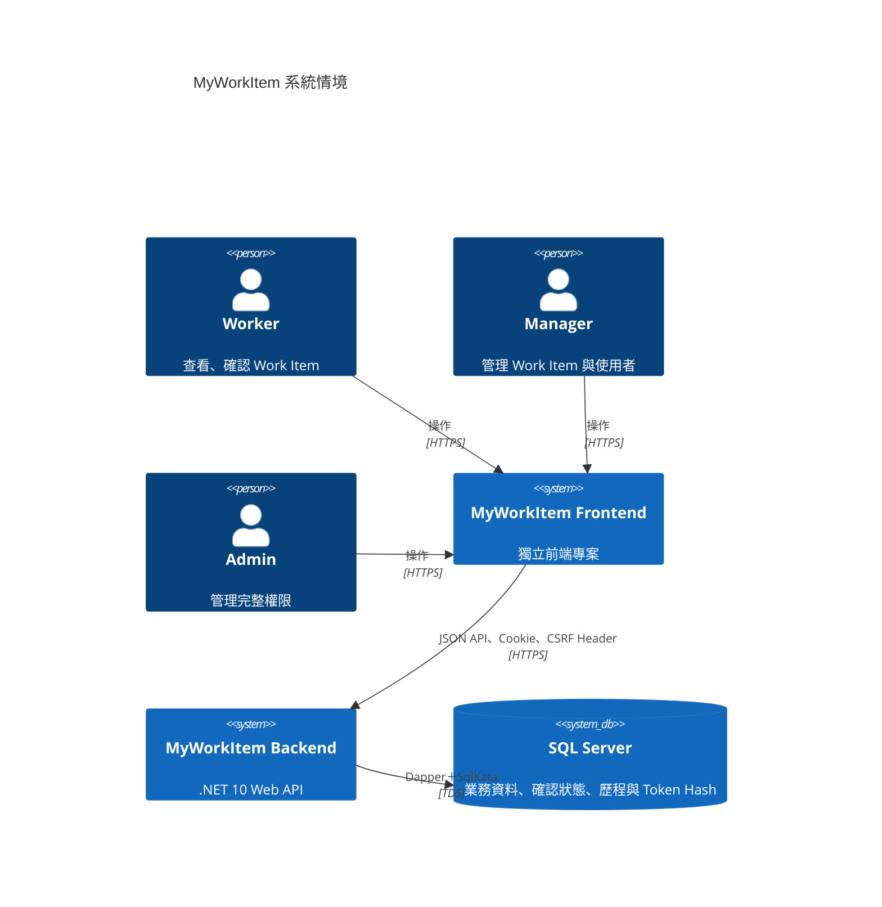
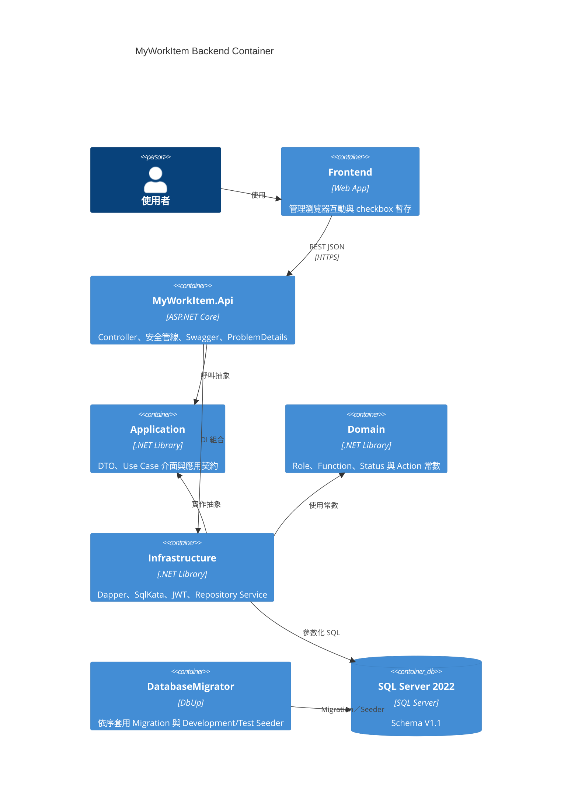

# 架構圖

## C4 Context

```mermaid
C4Context
    title MyWorkItem 系統情境
    Person(worker, "Worker", "查看、確認 Work Item")
    Person(manager, "Manager", "管理 Work Item 與使用者")
    Person(admin, "Admin", "管理完整權限")
    System(frontend, "MyWorkItem Frontend", "獨立前端專案")
    System(backend, "MyWorkItem Backend", ".NET 10 Web API")
    SystemDb(database, "SQL Server", "業務資料、確認狀態、歷程與 Token Hash")

    Rel(worker, frontend, "操作", "HTTPS")
    Rel(manager, frontend, "操作", "HTTPS")
    Rel(admin, frontend, "操作", "HTTPS")
    Rel(frontend, backend, "JSON API、Cookie、CSRF Header", "HTTPS")
    Rel(backend, database, "Dapper＋SqlKata", "TDS")
```

## C4 Container

```mermaid
C4Container
    title MyWorkItem Backend Container
    Person(user, "使用者")
    Container(frontend, "Frontend", "Web App", "管理瀏覽器互動與 checkbox 暫存")
    Container(api, "MyWorkItem.Api", "ASP.NET Core", "Controller、安全管線、Swagger、ProblemDetails")
    Container(application, "Application", ".NET Library", "DTO、Use Case 介面與應用契約")
    Container(domain, "Domain", ".NET Library", "Role、Function、Status 與 Action 常數")
    Container(infrastructure, "Infrastructure", ".NET Library", "Dapper、SqlKata、JWT、Repository Service")
    Container(migrator, "DatabaseMigrator", "DbUp", "依序套用 Migration 與 Development/Test Seeder")
    ContainerDb(sqlserver, "SQL Server 2022", "SQL Server", "Schema V1.1")

    Rel(user, frontend, "使用")
    Rel(frontend, api, "REST JSON", "HTTPS")
    Rel(api, application, "呼叫抽象")
    Rel(api, infrastructure, "DI 組合")
    Rel(infrastructure, application, "實作抽象")
    Rel(infrastructure, domain, "使用常數")
    Rel(infrastructure, sqlserver, "參數化 SQL")
    Rel(migrator, sqlserver, "Migration／Seeder")
```
