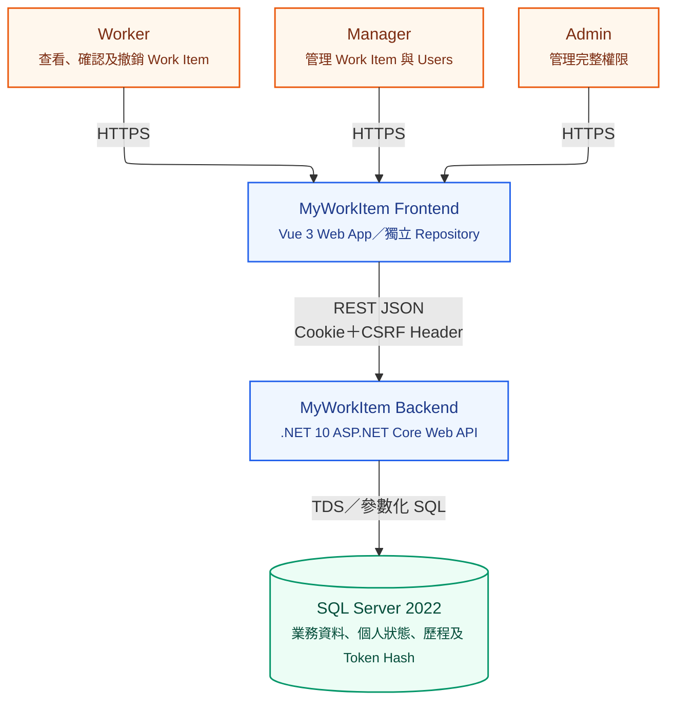
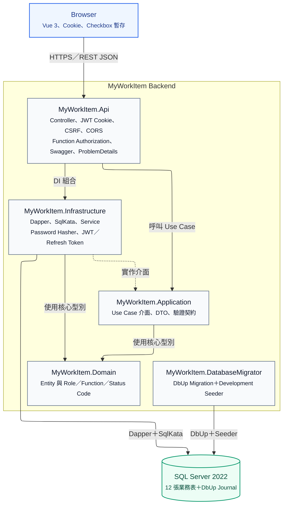
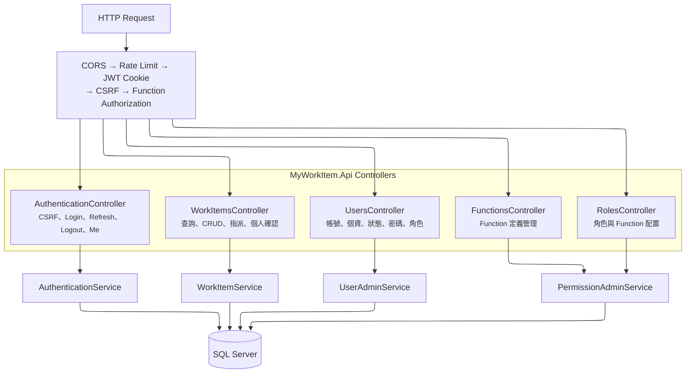
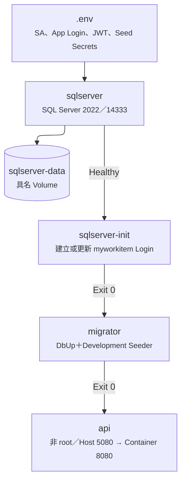

# 系統架構

本文件描述目前 `dev2` 的實際架構。前端位於獨立 Repository；本 Repository 只負責後端 API、資料庫版本控制、Migration 與自動化測試。

## C4 Context

## C4 Container

## API Component

## Docker Deployment

### 責任與限制

- `sa` 僅供 SQL Server 初始化與 `sqlserver-init` 使用；API、Migrator 與 IDE 使用 `myworkitem` Login。
- `EnsureLocalLogin.sql` 目前為本機開發方便授予 `myworkitem` `sysadmin`；這不是 Production 最小權限設計。
- API Container 使用 .NET `app` 非 root 使用者；SQL Server Image 與 Apple Silicon `linux/amd64` 模擬僅供本機開發。
- Production 不應使用本機 Compose Secret、示範 Seed Account 或 `EnsureLocalLogin.sql`。
