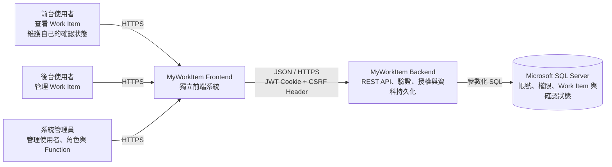
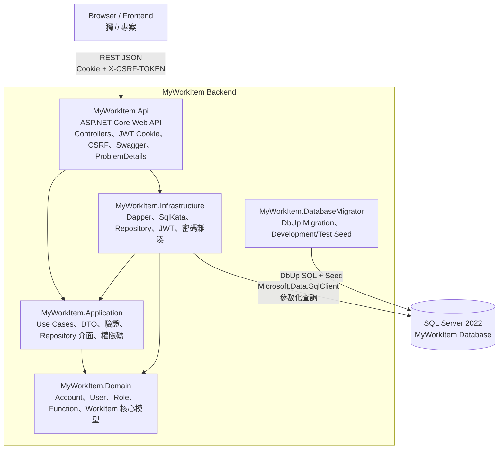
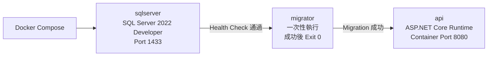
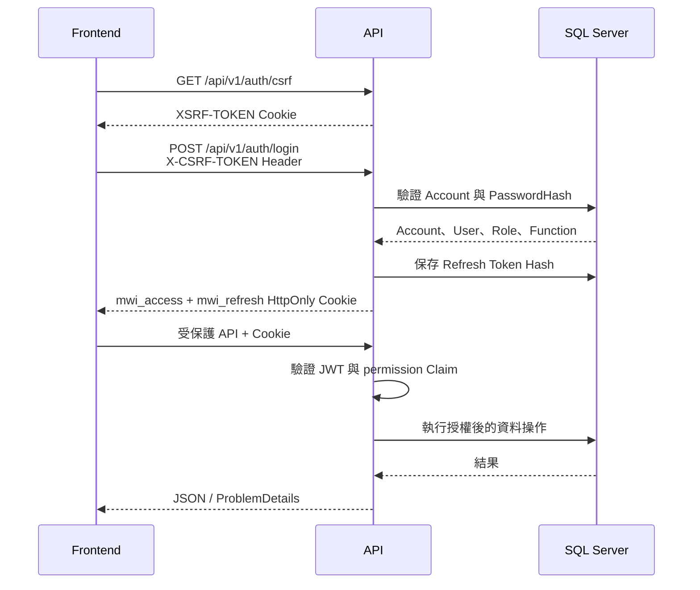

# MyWorkItem Backend 架構

本文件使用 C4 的 Context 與 Container 視角說明系統邊界。圖表採通用 Mermaid
flowchart 表達，以提高 GitHub、IDE 與 Markdown 閱讀器的相容性。

## C4 Context

### 系統責任

| 系統／人員 | 責任 |
| --- | --- |
| 前台使用者 | 查看全部有效 Work Item，確認或撤銷自己的確認狀態 |
| 後台使用者 | 新增、修改與軟刪除 Work Item |
| 系統管理員 | 維護使用者、角色、Function 與授權關係 |
| Frontend | 畫面、暫時 Checkbox 狀態、Credentials 與 CSRF Header 傳送 |
| Backend | API 契約、JWT Cookie、CSRF、權限驗證、交易與資料持久化 |
| SQL Server | 保存帳號、角色、權限、Refresh Token、Work Item 與個人確認紀錄 |

## C4 Container

## 執行與部署容器

依賴順序為 `sqlserver healthy` → `migrator completed successfully` → `api start`。
API 與 Migrator 都使用非 root 的 `$APP_UID` 執行。

## 驗證與授權流程

## 重要設計決策

- Work Item 對全部登入使用者可見，不建立指派資料表。
- Checkbox 暫選由前端管理；後端只保存已確認／待確認狀態。
- 個人狀態以 `(UserId, WorkItemId)` 複合主鍵隔離，使用者不能傳入其他 `UserId`。
- Work Item 使用軟刪除；一般清單與詳情排除 `DeletedAt` 不為空的資料。
- Work Item 更新使用 SQL Server `rowversion` 防止 Lost Update。
- Access Token 有效 15 分鐘；Refresh Token 有效 7 天並採輪替與 Token Family 撤銷。
- SqlKata 負責組合參數化查詢，Dapper 負責執行與映射，不使用 EF Core。
