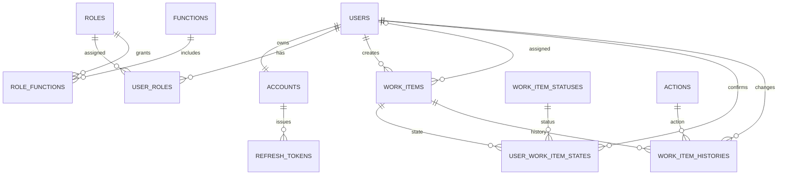

# DB 結構與 ERD

正式 DDL 位於 `database/migrations/`，下圖是 Schema V1.1 的關聯摘要。

關鍵規則：

- `Accounts.UserId` UNIQUE，確保 User／Account 一對一。
- `AssignedUserId` 可為 NULL；不限制其他登入者查看或確認。
- `UserWorkItemStates` 以 `(UserId, WorkItemId)` 為 PK；無資料代表 Pending，Confirm 時 Upsert，撤銷時刪除。
- Work Item 無 `IsDeleted` 與全域 Status；`DeletedAt` 表示軟刪除。
- `rowversion` 防止 Lost Update；CRUD 與 after-snapshot History 在同一 Transaction。
- 個人確認不寫入 Work Item History。
- 所有 FK 使用 NO ACTION，不使用 Cascade Delete。
