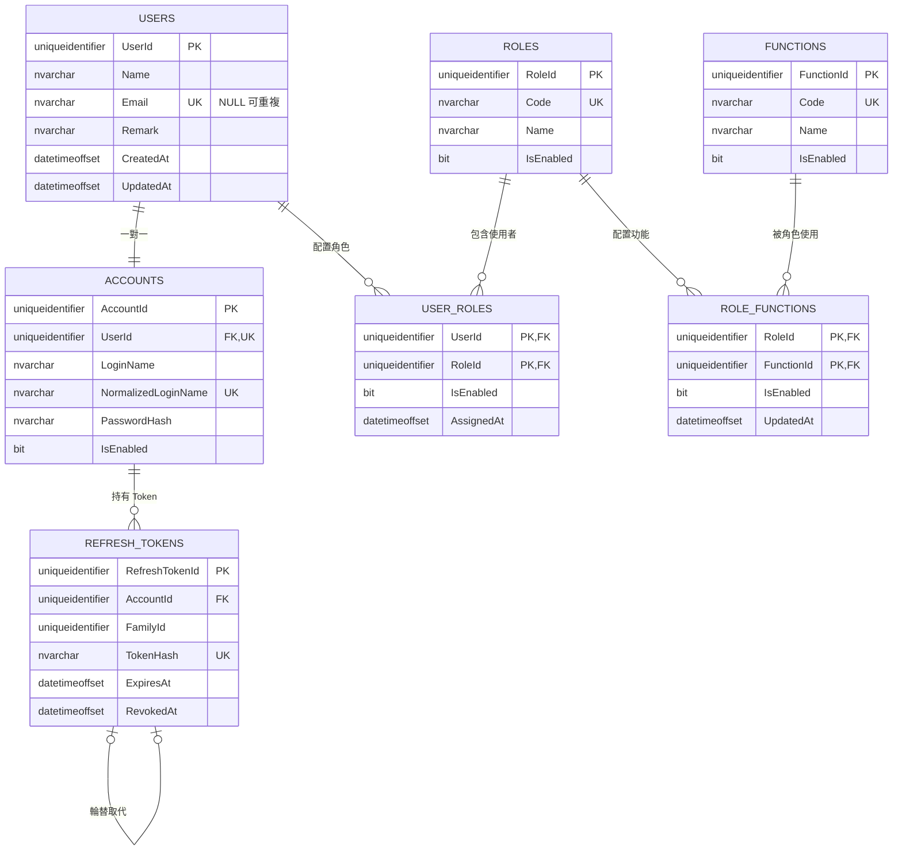
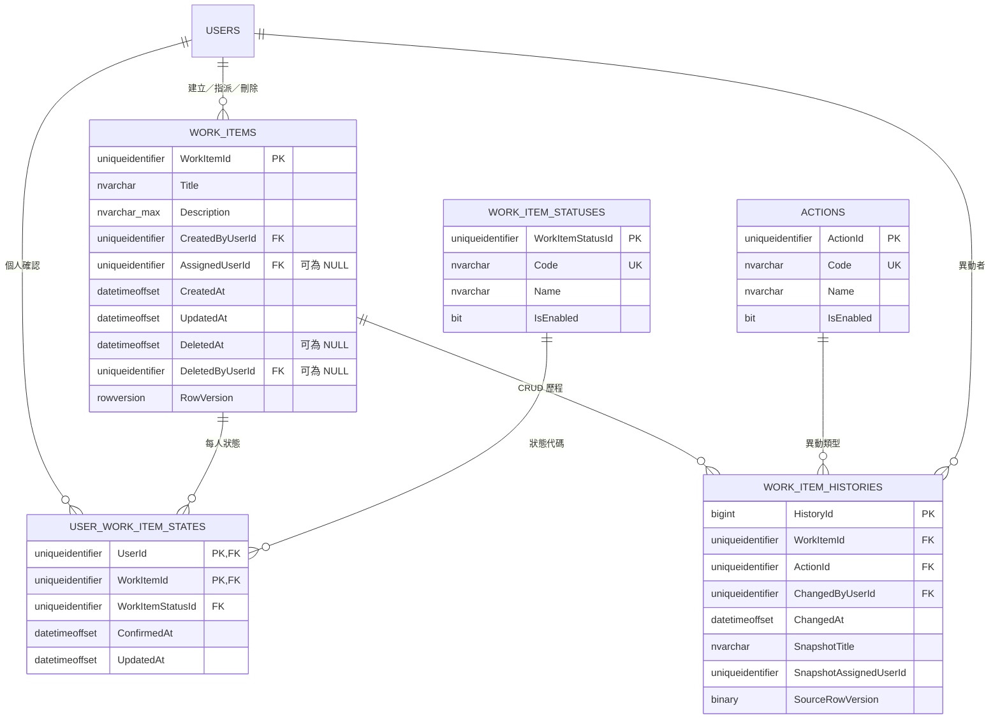

# Database 結構與 ERD

正式 DDL 以 `database/migrations/` 為唯一來源。DbUp 從空資料庫依序執行 `001_InitialSchema.sql`、`002_StaticData.sql`，並在 Journal 記錄已套用版本。

目前包含 12 張業務資料表；實際資料庫另有 1 張 DbUp Journal Table。

## 身分與權限

## Work Item 領域

## Table 責任摘要

| Table | 主鍵 | 責任 |
| --- | --- | --- |
| `Users` | `UserId` | 個人資料與稽核時間 |
| `Accounts` | `AccountId` | 登入名稱、Password Hash、啟用狀態；`UserId` UNIQUE |
| `Roles` | `RoleId` | 角色定義，`Code` 建立後不可修改 |
| `Functions` | `FunctionId` | Function 定義，`Code` 建立後不可修改 |
| `UserRoles` | `(UserId, RoleId)` | 使用者與角色多對多配置 |
| `RoleFunctions` | `(RoleId, FunctionId)` | 角色與 Function 多對多配置 |
| `RefreshTokens` | `RefreshTokenId` | Token Hash、Family、期限、撤銷與輪替關係 |
| `WorkItems` | `WorkItemId` | Work Item 內容、可選指派、軟刪除與 RowVersion |
| `UserWorkItemStates` | `(UserId, WorkItemId)` | 每位使用者自己的確認狀態 |
| `WorkItemHistories` | `HistoryId` | Work Item CRUD 的 after-snapshot 稽核 |
| `WorkItemStatuses` | `WorkItemStatusId` | `Pending`／`Confirm` 靜態代碼 |
| `Actions` | `ActionId` | `INSERT`／`UPDATE`／`DELETE` 靜態代碼 |

## 資料一致性規則

- 所有業務 UUID 使用 `uniqueidentifier`；時間使用 UTC `datetimeoffset(7)`。
- `Accounts.UserId` UNIQUE，確保 User／Account 一對一；登入名稱以 `NormalizedLoginName` UNIQUE。
- `AssignedUserId` 可為 `NULL`，只作顯示與篩選，不限制其他登入者查看或確認。
- `UserWorkItemStates` 無資料列代表 `Pending`；確認時 Upsert `Confirm`，撤銷時刪除資料列。
- `WorkItems` 不保存全域 Status 或 `IsDeleted`；`DeletedAt`／`DeletedByUserId` 成對表示軟刪除。
- `rowversion` 用於 Update 的 Optimistic Concurrency；不一致時 API 回傳 `409 Conflict`。
- Work Item CRUD 與 `WorkItemHistories` after-snapshot 在同一 Transaction；個人確認不寫入 Work Item History。
- `WorkItemHistories.ChangedByUserId` 記錄實際操作使用者；例如 Admin 編輯時會保存 Admin 的 `UserId`，查詢時可連接 `Accounts` 顯示 `LoginName = 'Admin'`，不重複保存可變動的帳號名稱。
- FK 未設定 Cascade Delete，刪除行為由應用程式明確管理。
- `IX_WorkItems_Active_CreatedAt` 支援有效項目預設排序；`IX_WorkItems_AssignedUserId` 支援指派篩選。

## Schema 版本控制

新增 Schema 變更時必須增加下一個不可變更的 Migration，不得回頭修改已部署 Migration。測試需從空 SQL Server 驗證 Migration 可建立、可重跑，並核對 PK、FK、UNIQUE、CHECK、Index 與靜態資料。
