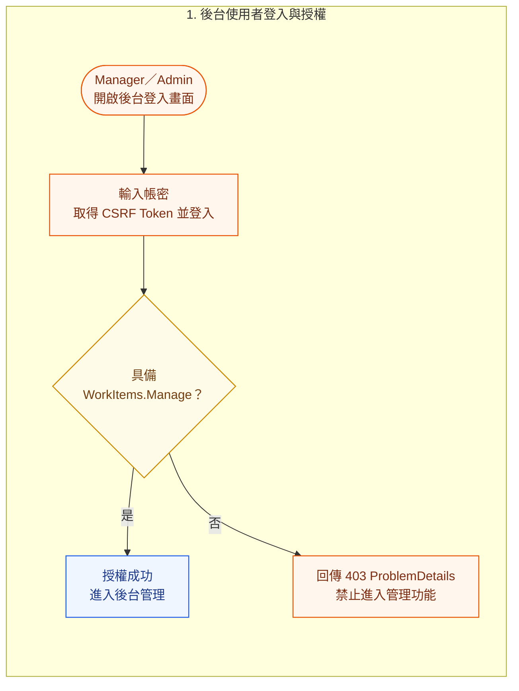
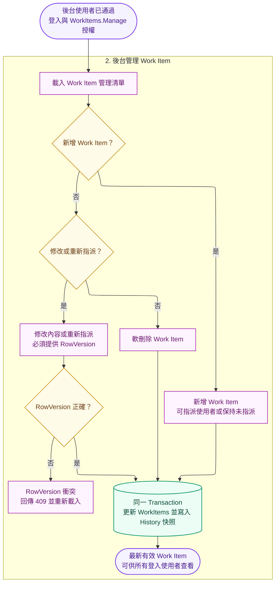
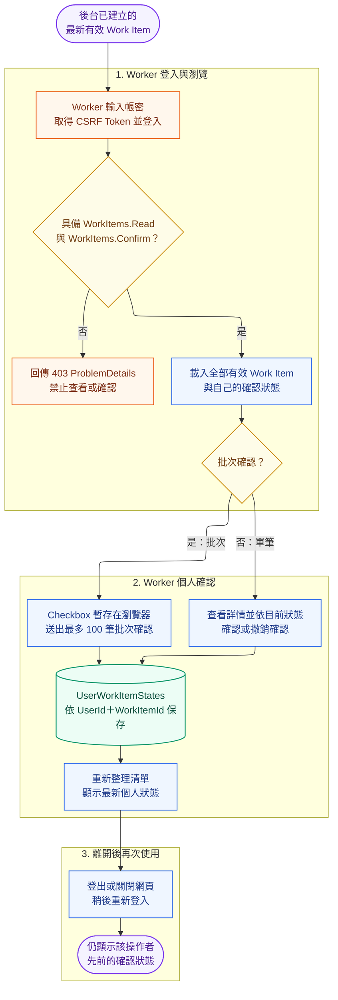

# Runtime Workflow

管理者 CRUD 時，Work Item mutation 與 `WorkItemHistories` after-snapshot 必須在同一 Transaction；Update 的 Base64 RowVersion 不符時回 409。批次確認先鎖定並確認全部 ID 有效，任一不存在即 Rollback。

## 操作者使用情境 Workflow

以下流程串接後台使用者（Manager／Admin）與一般操作者（Worker）。後台使用者先維護 Work Item，Worker 再查看及操作個人確認狀態。Checkbox 只保存在瀏覽器，只有送出確認後，後端才會依目前 JWT 的 `UserId` 保存個人確認狀態。

### 後台使用者登入與授權 Decision

此段依照 Decision 慣例固定位置：「是」向右進入後台，「否」垂直向下回傳拒絕結果。

### 後台管理 Work Item Workflow

後台使用者通過登入及 `WorkItems.Manage` 授權後，進入 Work Item 管理流程：

後台保存完成的有效 Work Item，會成為 Worker 查詢清單的資料來源；兩張圖不使用跨圖連線。

### Worker 使用 Workflow

Worker 登入後查看全部有效 Work Item，後端依目前 JWT 身分附加該 Worker 自己的確認狀態：

使用情境重點：

- 登入失敗不會進入 Work Item 清單，API 以 ProblemDetails 回傳錯誤。
- Manager 與 Admin 具備 `WorkItems.Manage`，可新增、修改、指派、清除指派及軟刪除 Work Item；Worker 不具備此權限。
- 後台修改與 Work Item History after-snapshot 必須使用同一 Transaction；RowVersion 衝突回傳 `409 Conflict`。
- Manager 另具備 `Users.Manage`；Admin 具備全部 Functions，可額外管理 Roles 與 Functions。這些權限變更會於下一個 Request 立即生效。
- 所有登入使用者可看到相同的有效 Work Item；`isConfirmed` 與 `confirmedAt` 依操作者而異。
- 單筆確認、撤銷及批次確認都以 JWT 身分決定操作者，Request 不接受 `UserId`。
- 批次確認最多 100 筆，任一項目無效時整批 Rollback。
- 重新登入後，後端從 `UserWorkItemStates` 還原該操作者先前的確認狀態。
