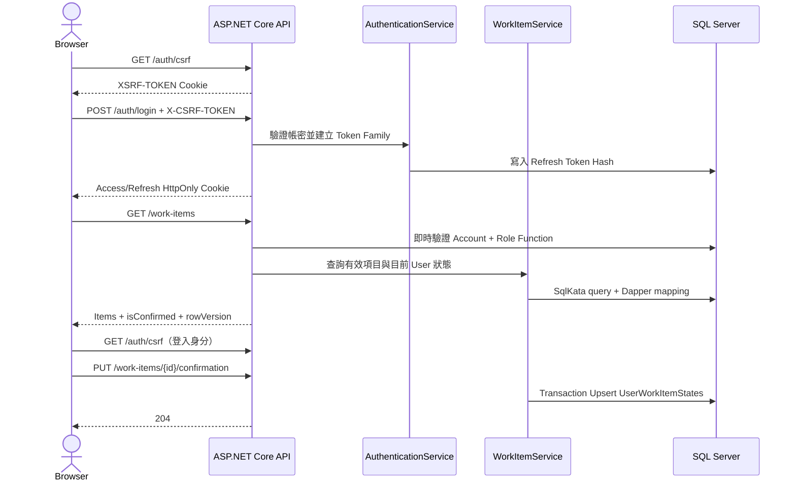

# Runtime Workflow

```mermaid
sequenceDiagram
    actor Browser
    participant API as ASP.NET Core API
    participant Auth as AuthenticationService
    participant WI as WorkItemService
    participant DB as SQL Server

    Browser->>API: GET /auth/csrf
    API-->>Browser: XSRF-TOKEN Cookie
    Browser->>API: POST /auth/login + X-CSRF-TOKEN
    API->>Auth: 驗證帳密並建立 Token Family
    Auth->>DB: 寫入 Refresh Token Hash
    API-->>Browser: Access/Refresh HttpOnly Cookie
    Browser->>API: GET /work-items
    API->>DB: 即時驗證 Account + Role Function
    API->>WI: 查詢有效項目與目前 User 狀態
    WI->>DB: SqlKata query + Dapper mapping
    API-->>Browser: Items + isConfirmed + rowVersion
    Browser->>API: GET /auth/csrf（登入身分）
    Browser->>API: PUT /work-items/{id}/confirmation
    WI->>DB: Transaction Upsert UserWorkItemStates
    API-->>Browser: 204
```

管理者 CRUD 時，Work Item mutation 與 `WorkItemHistories` after-snapshot 必須在同一 Transaction；Update 的 Base64 RowVersion 不符時回 409。批次確認先鎖定並確認全部 ID 有效，任一不存在即 Rollback。
