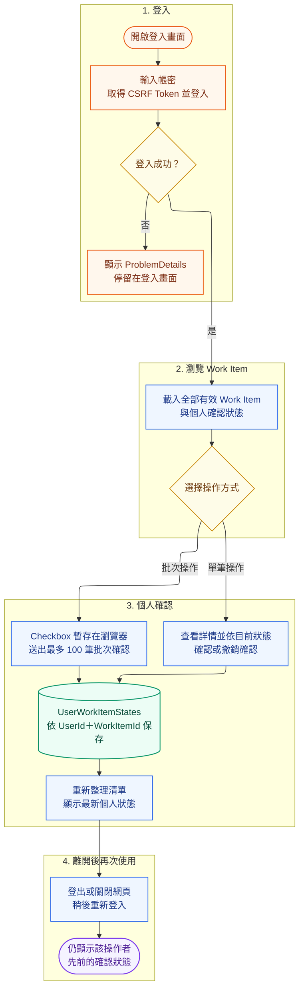

# Runtime Workflow

```mermaid
%%{init: {"flowchart": {"defaultRenderer": "elk", "nodeSpacing": 50, "rankSpacing": 75}}}%%
flowchart TD
    start(["使用者開啟前端"])

    subgraph authentication["1. Authentication"]
        direction TD
        csrfAnonymous["GET /auth/csrf"]
        csrfCookie["取得匿名<br/>XSRF-TOKEN Cookie"]
        login["POST /auth/login<br/>＋ X-CSRF-TOKEN"]
        verify["驗證帳密<br/>建立 Token Family"]
        saveRefresh[("SQL Server<br/>保存 Refresh Token Hash")]
        authCookies["回傳 Access／Refresh<br/>HttpOnly Cookie"]

        csrfAnonymous --> csrfCookie --> login --> verify --> saveRefresh --> authCookies
    end

    subgraph query["2. Query Work Items"]
        direction TD
        list["GET /work-items"]
        authorize["即時驗證 Account<br/>與 Role Function 聯集"]
        queryItems[("SQL Server<br/>SqlKata 組合查詢<br/>Dapper 執行映射")]
        listResult["回傳 Items<br/>isConfirmed＋rowVersion"]

        list --> authorize --> queryItems --> listResult
    end

    subgraph confirmation["3. Personal Confirmation"]
        direction TD
        csrfAuthenticated["GET /auth/csrf<br/>重新綁定登入身分"]
        confirm["PUT /work-items/{id}/confirmation<br/>＋ X-CSRF-TOKEN"]
        transaction[("SQL Server Transaction<br/>Upsert UserWorkItemStates")]
        noContent["204 No Content"]

        csrfAuthenticated --> confirm --> transaction --> noContent
    end

    start --> csrfAnonymous
    authCookies --> list
    listResult --> csrfAuthenticated

    classDef step fill:#EFF6FF,stroke:#2563EB,color:#1E3A8A,stroke-width:1.25px;
    classDef security fill:#FFF7ED,stroke:#EA580C,color:#7C2D12,stroke-width:1.25px;
    classDef storage fill:#ECFDF5,stroke:#059669,color:#064E3B,stroke-width:1.5px;
    class csrfAnonymous,csrfCookie,login,authCookies,csrfAuthenticated,confirm security;
    class verify,list,authorize,listResult,noContent step;
    class saveRefresh,queryItems,transaction storage;
```

管理者 CRUD 時，Work Item mutation 與 `WorkItemHistories` after-snapshot 必須在同一 Transaction；Update 的 Base64 RowVersion 不符時回 409。批次確認先鎖定並確認全部 ID 有效，任一不存在即 Rollback。

## 操作者使用情境 Workflow

以下流程以一般操作者（Worker）為主。Checkbox 只保存在瀏覽器，只有送出確認後，後端才會依目前 JWT 的 `UserId` 保存個人確認狀態。

使用情境重點：

- 登入失敗不會進入 Work Item 清單，API 以 ProblemDetails 回傳錯誤。
- 所有登入使用者可看到相同的有效 Work Item；`isConfirmed` 與 `confirmedAt` 依操作者而異。
- 單筆確認、撤銷及批次確認都以 JWT 身分決定操作者，Request 不接受 `UserId`。
- 批次確認最多 100 筆，任一項目無效時整批 Rollback。
- 重新登入後，後端從 `UserWorkItemStates` 還原該操作者先前的確認狀態。
