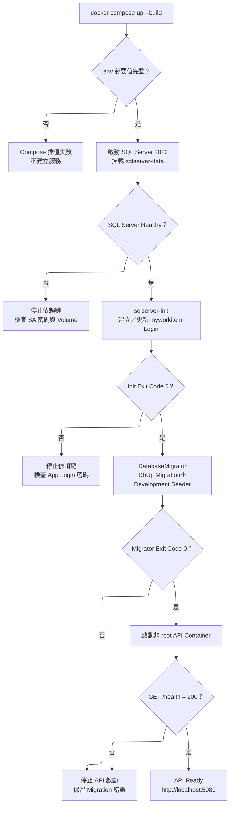
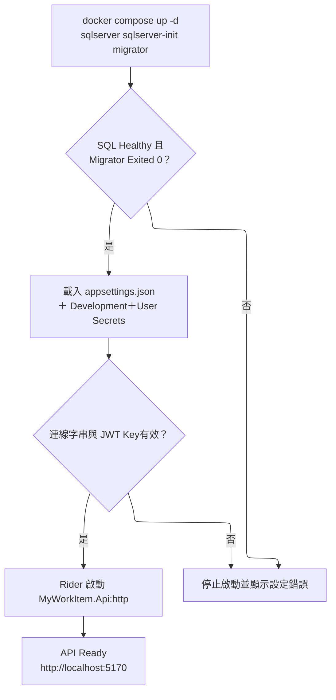
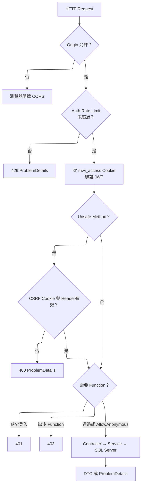
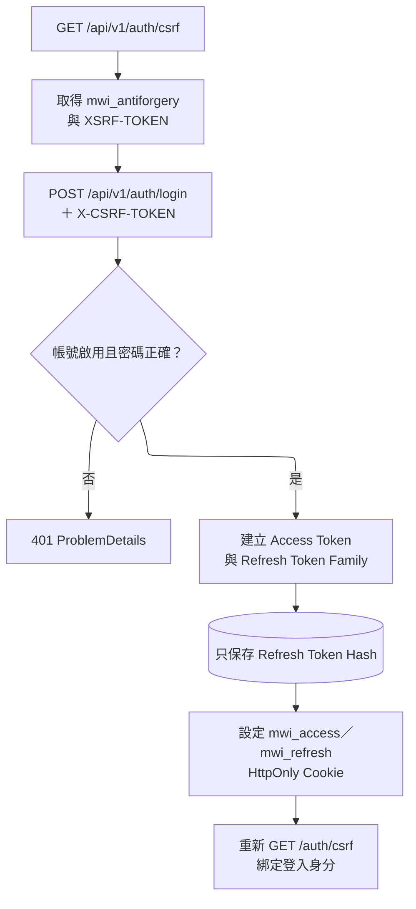
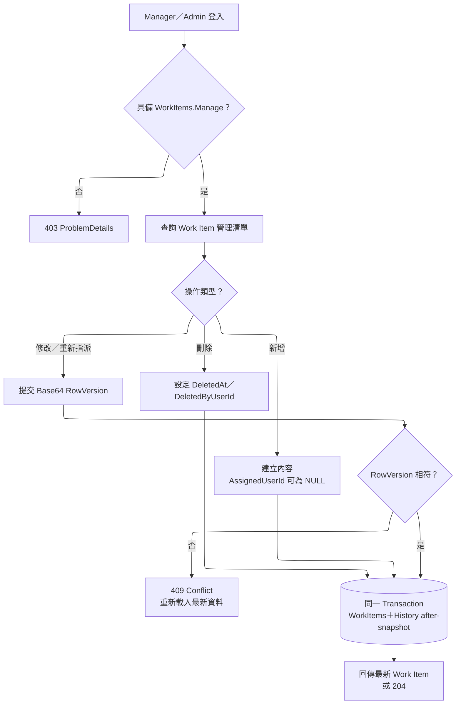
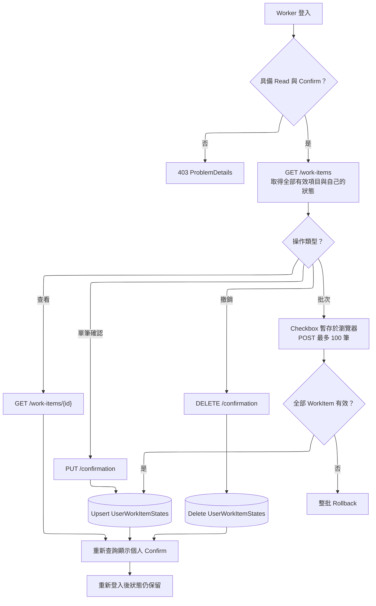

# Runtime Workflow

本文件只描述目前程式實際執行流程。設計背景與歷史決策見 `Draft/`，API 欄位以 OpenAPI 為準。

## 1. Docker 啟動流程

`docker compose down` 會保留資料；加入 `--volumes` 會永久刪除 `sqlserver-data`，只能在明確確認不保留本機資料後使用。

## 2. IDE 啟動流程

IDE 不讀取 Compose `.env`；`ConnectionStrings:DefaultConnection` 與 `Jwt:SigningKey` 必須放在 User Secrets 或 Rider Environment Variables。

## 3. HTTP Request Pipeline

Function Authorization 會即時查詢 Account、Role 與 Function 聯集；帳號停用或權限異動於下一個 Request 生效。

## 4. Authentication Workflow

Refresh 每次輪替 Token；重播舊 Refresh Token 時撤銷整個 Family。Logout 撤銷目前 Family 並清除 Access／Refresh Cookie。

## 5. 後台管理 Workflow

Manager 另具備 `Users.Manage`；Admin 具備 `Roles.Manage` 與 `Functions.Manage`。Code 建立後不可修改，停用以 `IsEnabled` 管理，不提供硬刪除。

## 6. Worker Workflow

所有登入使用者可查看相同有效 Work Item。`AssignedUserId` 不影響可見性；確認者只能來自 JWT，Request 不接受其他人的 `UserId`。

## 7. 自動化驗收對照

| Workflow | 驗證範圍 |
| --- | --- |
| WF-01 | CSRF 與 ProblemDetails |
| WF-02 | CSRF → Login → Me |
| WF-03 | Refresh 輪替與重播撤銷 |
| WF-04 | 列表、詳情、指派篩選與個人狀態 |
| WF-05 | 不同使用者確認隔離、撤銷與持久化 |
| WF-06 | 批次確認原子性與 Rollback |
| WF-07 | CRUD、History、RowVersion 409、軟刪除 |
| WF-08 | Users／Roles／Functions 與權限立即生效 |
| WF-09 | Logout 撤銷 Family、清 Cookie、Me 失效 |
| WF-10 | Admin → Manager → Worker 完整旅程 |
| WF-11 | Swagger 等價 Cookie／CSRF 操作旅程 |
